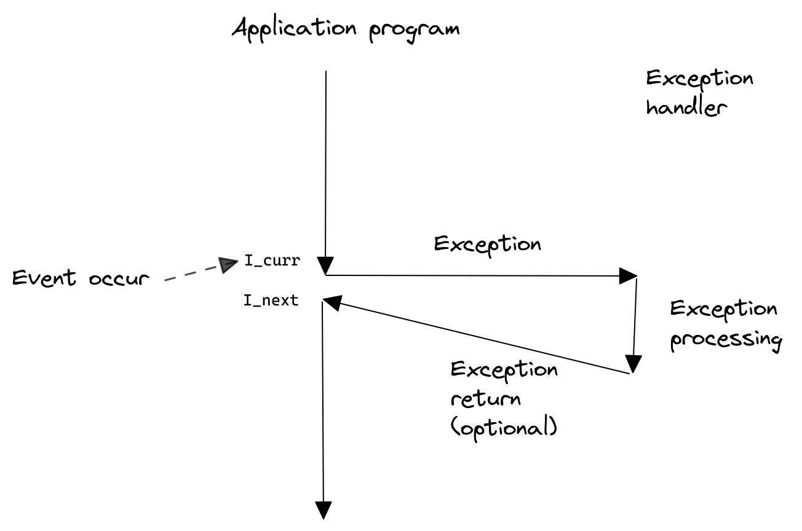

- ## 异常
	- ### 概述
	  collapsed:: true
		- 控制流中的突变，响应处理器状态中的某些变化
			- 变化可能与当前指令有关，如虚拟内存缺页，算数溢出，或者除以0。也可能无关，如系统定时器发出信号或者一个`I/O`请求完成
			- 状态变化称为**事件**
		- 当处理器检测到有事件发生时，首先通过一个叫做[[异常表]]的跳转表，进行一个间接过程调用，到一个专门设计用来处理这类事件的操作系统子程序(_异常处理程序(exception handler)_)。当异常处理程序完成处理后，根据事件类型，会发生以下其中一种情况
			- 1）处理程序将控制返回给当前指令$I_{curr}$
			- 2）处理程序将控制返回给下一条指令$I_{next}$
			- 3）处理程序终止被中断的程序
		- 
	- ### [[异常处理]]
	- ### [[异常类别]]
	-
	-
	-
	-