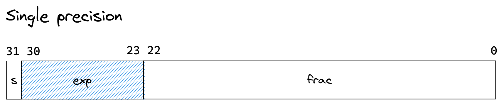
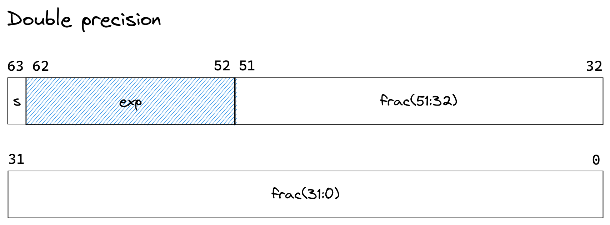

- ## 编码方式
	- IEEE标准用 $V = (-1)^s \times M \times 2^E$ 来表示一个数。
		- $S$表示符号位
		- $M$表示一个二进制小数
		- $E$表示阶
	- 将浮点数的表示划分为三个字段，并分别对它们进行编码
		- 一个单独的符号位$s$直接编码符号$s$。
		- $k$位的阶码字段$\textrm{exp}=e_{k-1} \mathellipsis e_1 e_0$编码阶码$E$
		- $n$位小数字段$\textrm{frac} = f_{n-1} \mathellipsis f_1 f_0$编码尾数$M$，但编码出来的值也依赖与阶码的值是否等于0。
- ## 格式
	- 单精度浮点数格式
		- 
	- 双精度浮点数格式
		- 
- ## 浮点数编码的三种情况
	- [[规格化的值]]
	- [[非规格化的值]]
	- [[特殊值]]
	- [[非规格化到规格化]]
- ## 舍入
	- 默认方法是向偶数舍入，也被称为向最接近的值舍入。当最近的值有两个时，像偶数舍入。
	- 向零舍入
	- 向下舍入
	- 向上舍入
- ## [[浮点运算]]
- [[C语言中的浮点数]]