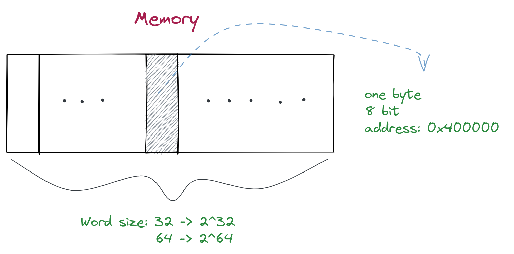

- ## 字长
	-
	- 
	- 在内存中，最小的信息单位是字节`byte`，有8个位。每个在内存中的字节都有一个独立的地址
	- 内存的大小和字长相关, 字长32位的机器有`2^32`个字节的内存，也就是4GB。
- ## 字节顺序
	- 对一个多字节的程序对象，要知道它的存储建立在两个规则上：
		- **对象的位置**
			- 对象的位置在它所使用的字节中最小的那个地址
		- **对象如何排列**
			- [[Big Endian]]大端法
			- [[Little Endian]]小端法