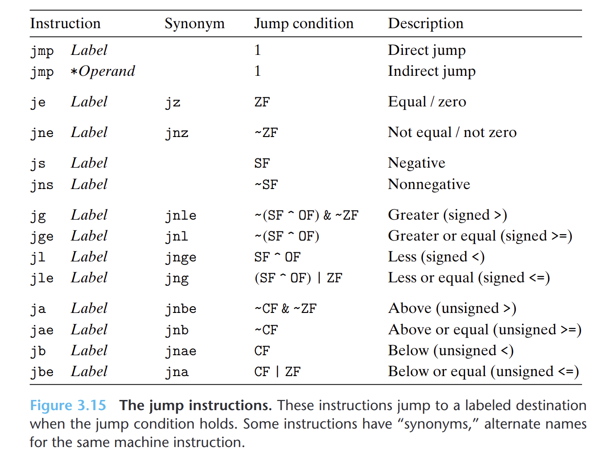

- 跳转指令会导致执行切换到程序中一个全新的位置。在汇编代码中，跳转的目的地通常用一个标号指明。
- {:height 444, :width 585}
	- **直接跳转**
		- 跳转目标作为指令的一部分编码，在汇编代码中，跳转目标作为一个标号给出，写作`jmp *Label`
	- **间接跳转**
		- 跳转目标从寄存器或内存中读出，写作`jmp *Operand`。
- ## 跳转指令的编码
	- [[PC相对寻址]]
	- 绝对寻址
		- 用四个字节直接指定目标。
	-