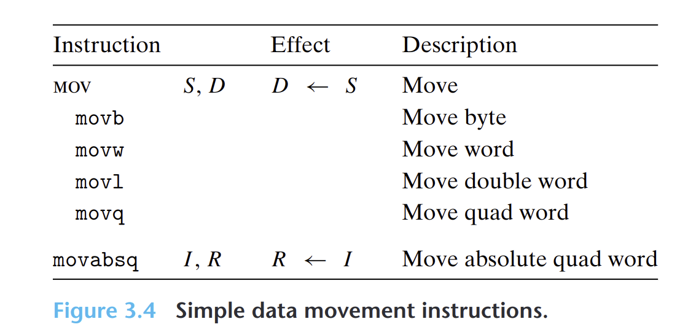

- 把数据从源位置复制到目的位置，不做任何变化。
- {:height 267, :width 546}
- **源操作数**指定的值是一个立即数，存储在寄存器或者内存中。
- **目的操作数**指定一个位置，要么是寄存器，要么是一个内存地址。
- **x86规定**两个操作数不能都指向内存位置。
- **任何**为寄存器生成32位值的指令，都会把该寄存器的高位部分设置成0。
- `movq`指令只能以表示为32位补码数字的立即数作为源操作数，然后把这个值符号扩展得到64位的值。
- `movabsq`指令只能以任意64位立即数值作为源操作数，并且**只能**以寄存器作为目的