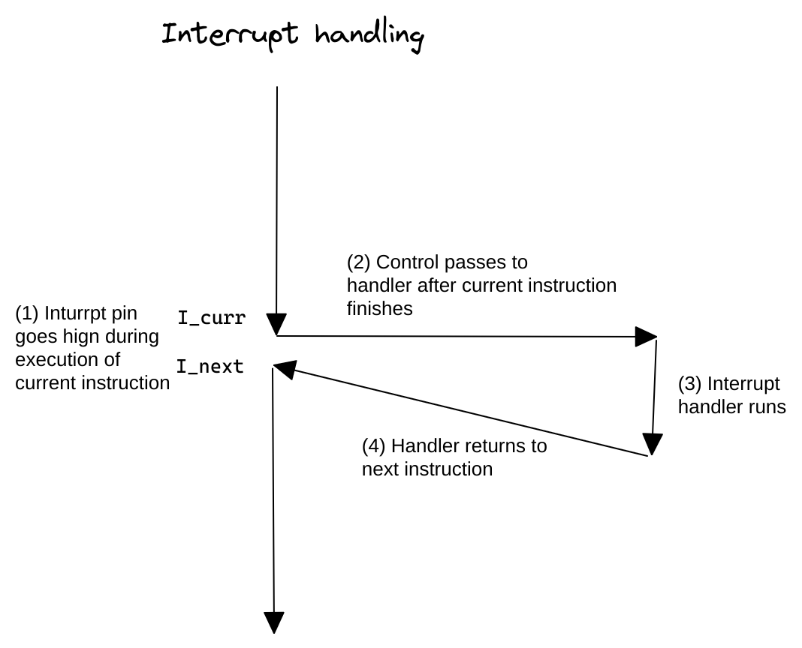

- ## 概念
	- 中断是异步发生的，是来自处理器外部I/O设备的信号的结果。
	- 从硬件中断不是由任何一条专门的指令造成的这个意义上来说，它是异步的。
	- 硬件中断的处理程序常常称为中断处理程序(_interrupt handler_)
- ## 流程
	- I/O设备通过向处理器芯片上的一个引脚发信号，并将异常号放到系统总线上，来触发中断，这个异常号标识了引起中断的设备
	- 当前指令^^完成执行^^后，处理器注意到中断引脚的电压变高了，就从[[系统总线]]读取异常号，调用异常处理程序。
	- 当处理程序返回时，将控制返回给下一条指令执行，就好象没有发生中断一样。
	- 