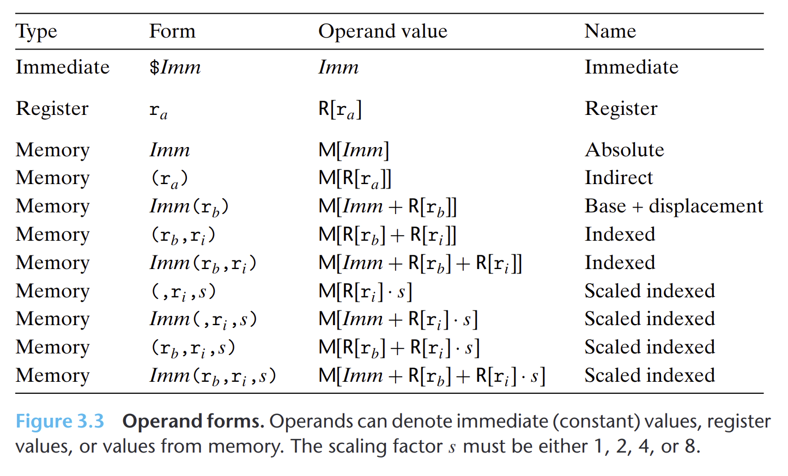

- 大多数指令有一个或多个操作数，指示出执行一个操作中要使用的*源数据值*，以及放置结果的目的位置。
	- 源数据值可以以常数形式给出，或是从寄存器或内存中取出
- ## 三种类型
	- 立即数：用来表示常数值，ATT格式书写方式是`$ Imm`。不同指令的立即数值范围不同。汇编器会选择最紧凑的方式进行数值编码。操作数的值是$Imm$
	- 寄存器：表示某个寄存器的内容。用符号$r_a$表示。操作数的值是$R[r_a]$，表示将寄存器集合堪称一个数组$R$，用寄存器表示符作为索引
	- 内存引用：根据计算出来的地址访问某个内存位置。用符号$M[Addr]$表示对存储在内存中地址$Addr$处的内容的引用，也就是操作数的值。
		- **寻址模式**：$Imm(r_b, r_i, s)$，由四个部分组成：立即数偏移$Imm$，基址寄存器$r_b$，变址寄存器$r_i$，比例因子$s$。计算方式是$Imm + R[r_b] + R[r_i] \cdot s$。
- {:height 376, :width 611}