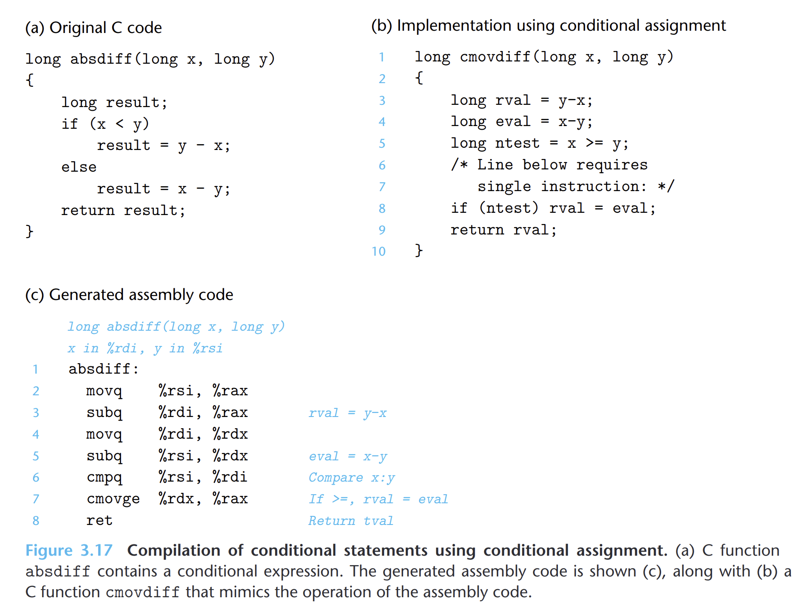

- 条件控制实现条件分支可能会非常低效，在一些受限的条件下可以使用条件传送。
- 条件传送计算一个条件的两种结果，然后在根据条件是否满足从中选取一个。
- 
- ## 理解
	- 假设 `v = test-expr? then-expr: else-expr`
	- 基于条件传送，会对`then-expr`和`else-expr`都求值。最终值的选择根据对`test-expr`的求值。
	- 如果两个表达式的任意一个可能产生错误条件或者副作用，就会导致非法的行为。不适合使用条件传送。
	- 如果两个表达式需要进行大量的计算，那么条件传送也不一定比条件控制效率更高。