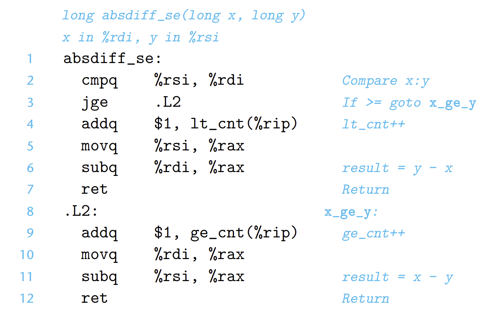

- ## 原始C代码
	- ```C
	  long lt_cnt = 0;
	  long ge_cnt = 0;
	  
	  long absdiff_se(long x, long f) {
	    long result;
	    if(x < y) {
	      lt_cnt++;
	      result = y-x;
	    } else {
	      ge_cnt++;
	      result = x-y;
	    }
	    return result
	  }
	  ```
- ## goto版本
	- ```C
	  long gotodiff_se(long x, long y) {
	    long result;
	    if (x >= y)
	      goto x_ge_y;
	    lt_cnt++;
	    result = y-x;
	    return result;
	  x_ge_y:
	    ge_cnt++;
	    result = x-y;
	    return result;
	  }
	  ```
- ## 汇编代码
	- {:height 336, :width 527}