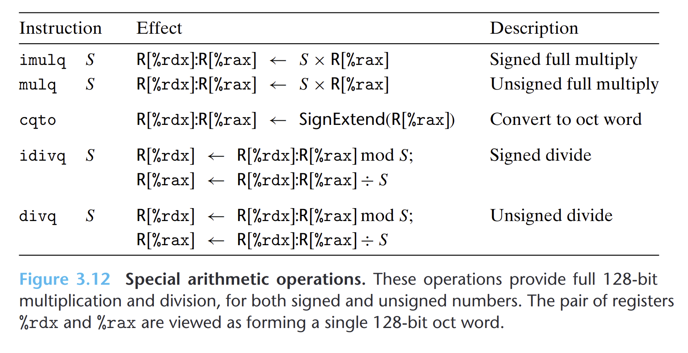

- 两个64位有符号或无符号相乘得到的乘积需要128位来表示。x86-64指令集对128位提供了有限的支持。
- 单操作数的`imulq`和`mulq`要求一个参数必须在寄存器`%rax`中，而另一个参数作为指令的源操作数给出。计算结果存放在`%rdx`(高64位)和`%rax`(低64位)。
- 除法操作和取模操作都是由单操作数除法指令提供的。被除数存放在`%rdx`(高64位)和`%rax`(低64位)中，除数作为操作数，得到商存放在`rax`，余数存放在`%rdx`。
- {:height 354, :width 707}
-