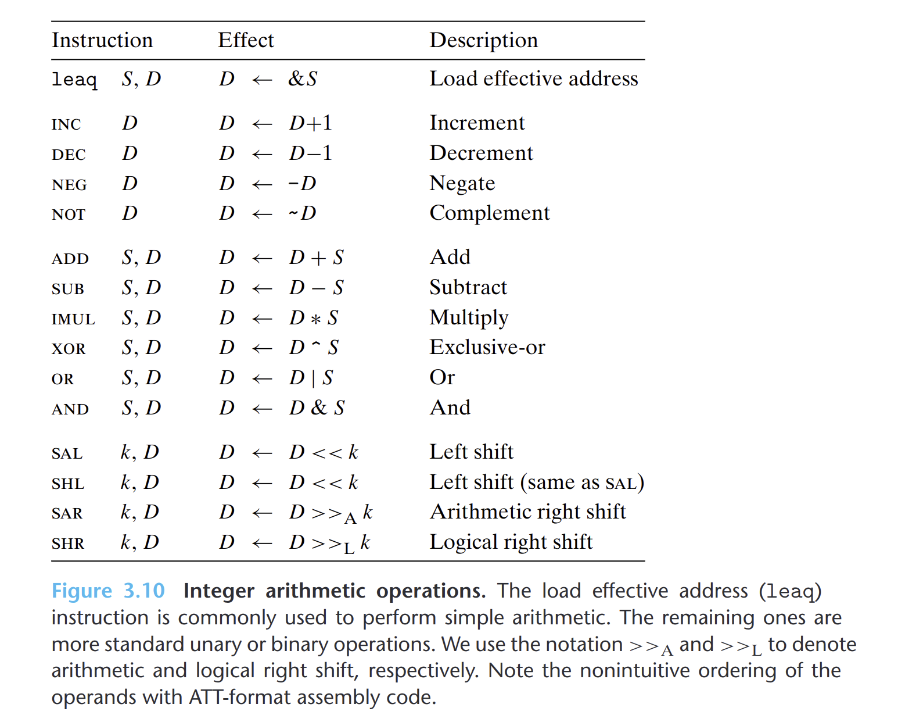

- 分为四组：加载有效地址，一元操作，二元操作和移位。
- ## 加载有效地址
	- 加载有效地址指令`leaq`是将有效地址写入到目的操作数。因此可以用作简单的计算
- ## 一元和二元操作
	- 一元操作只有一个操作数，既是源又是目的
	- 二元操作的第一个操作数是源，第二个操作数既是源又是目的。当第二个操作数是内存地址时，处理器必须从内存读出值，执行操作，再把结果写回内存。
- ## 移位操作
	- 先给出移位量，第二项给出要移位的数。可以进行算数或逻辑右移
	- 移位量可以是一个立即数，或者放在**单字节寄存器`%cl`**中。
		- 理论上移位量的编码范围是$2^8-1=255$。x86-64中，移位操作对$w$位长的数据值进行操作，移位量由`%cl`的低$m$位决定，这里$2^m=w$。高位会被忽略。
- {:height 577, :width 709}