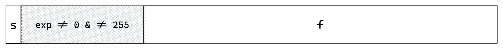

- ## 阶码
	- 当 $\textrm{exp}$ 的位模式既不全为0也不全为1时。在这种情况下，阶码字段被解释为以偏置形式表示的有符号整数，也就是说阶码的值 $E=e-Bias$ 其中 $e$ 是无符号数，$Bias$ 是一个等价于 $2^{k-1}-1$ 的偏置量。
		- 因为$\textrm{exp}$的位模式不为全0，也不为全1。则：
			- $e_{min} = 1$
			- $e^{single}_{max} = (2^7+\mathellipsis + 2^1) = 254$
			- $e^{double}_{max} = (2^10+\mathellipsis + 2^1) = 2046$
		- 如果是单精度数，则$k=8$，得到$Bias=2^{8-1}-1 = 127$
			- 阶码的最小值是$e_{min}-Bias  = 1 - 127 = -126$
			- 阶码的最大值是$e^{single}_{max} - Bias = 254 - 127 = 127$
		- 如果是双精度数，则$k = 11$，得到$Bias = 2^{11-1}-1 = 1023$
			- 阶码的最小值是$e_{min}-Bias  = 1 - 1023 = -1022$
			- 阶码的最大值是$e^{double}_{max} - Bias = 2046 - 1023 = 1023$
- ## 小数字段
	- 小数字段被解释为描述小数值 $f$ ,其中 $0 \leq f < 1$ ,其二进制表示位 $0.f_{n-1}\cdots f_1f_0$ 。$M$ 被定义为 $M=1+f$ ，即隐含了以1开头。
	- 因为可以调整阶码 $E$ , 保证 $M$ 在1到2之间，我们就获得了一个精度位，1不用显式地表示。
- 