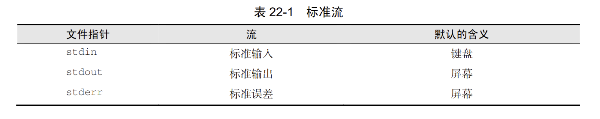
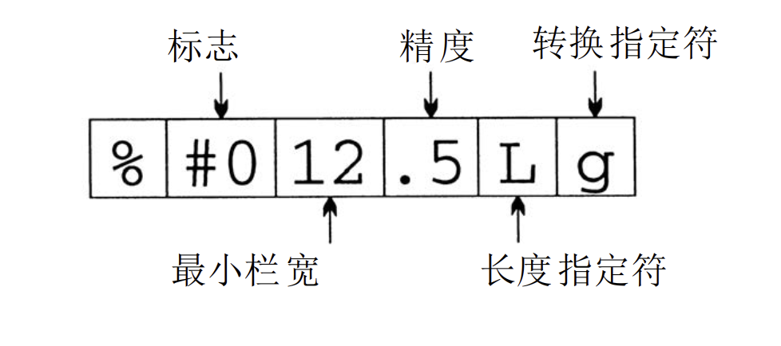
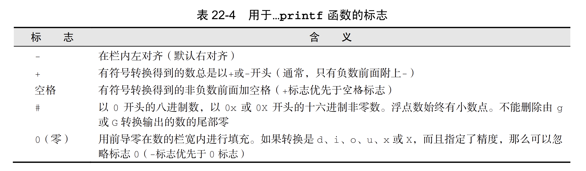
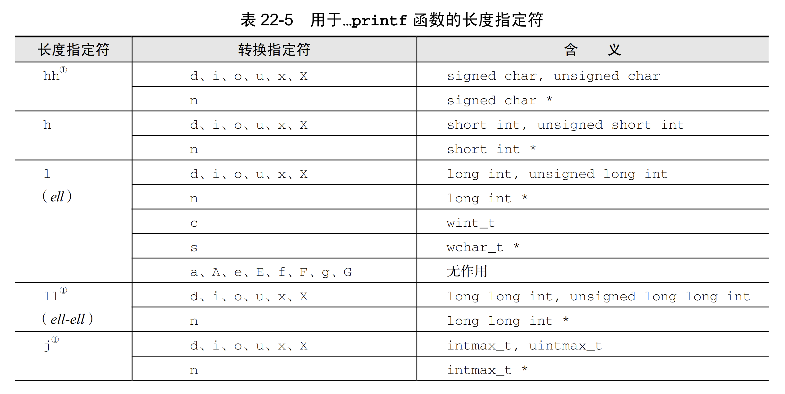
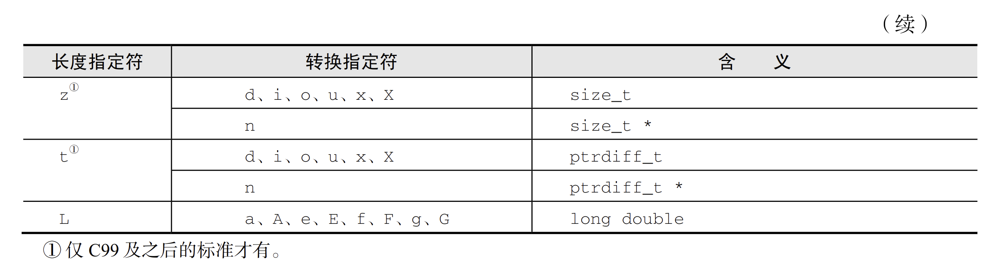
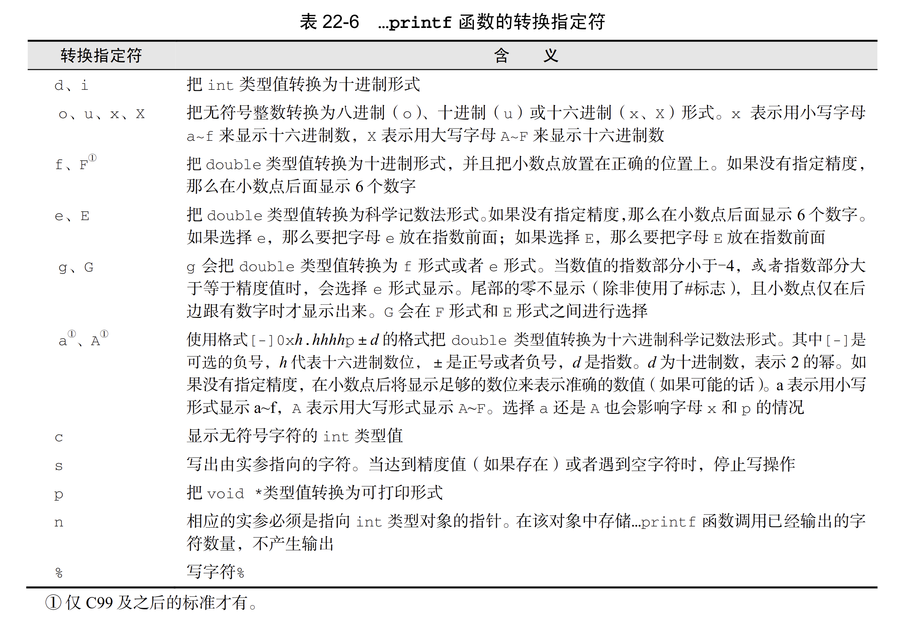

- **流**: 在C语言中，标识任意输入的源或任意输出的目的地。
- **文件指针**: C语言中对流的访问是通过文件指针实现的。用`FILE *`表示。
- ## `<stdio.h>`
	- 
	- 输出重定向会把`stdout`所有内容放到文件中。如果需要屏幕输出错误信息，可以使用`stderr`
	- `<stdio.h>`支持两种类型的文件: 文本文件、二进制文件。
		- 文本文件可以分为若干行，不同系统的行末标记不同。
		- 文本文件可以包含一个特殊的“文件末尾”标记。
- **文件操作**
	- 重定向虽然简单有效，但如果需要控制读入的文件时，或者读写多个文件都受到限制。所欲需要文件操作。
	- **打开文件**
		- ```C
		  FILE *fopen(const char * restrict filename, const char * restrict mode);
		  ```
		- `restrict`表示所指向的字符串的内存单元不共享。
		- 函数返回的指针通常存储在一个变量中，以便稍后再需要对文件进行操作时使用。
		- 若无法打开文件，则函数返回空指针。
		- #+BEGIN_IMPORTANT
		  永远不要假设可以打开文件，每次都要测试`fopen`函数的返回值以确保不是空指针
		  #+END_IMPORTANT
		- 给函数传递的模式字符串取决于稍后要对文件采取的操作，和文件中数据的形式是文本文件还是二进制。
			- [[fopen函数的模式字符串]]
			- 当打开文件用于读和写(模式字符串包含`+`)时，
				- 如果没有先调用一个文件定位函数，那么就不能从读模式转换成写模式，除非读操作遇到了文件的末尾
				- 如果没有调用`fflush`函数，也没有调用文件定位函数，那么就不能从写模式转换成读模式。
	- **关闭文件**
		- ```C
		  int fclose(FILE *stream);
		  ```
		- `fclose`函数让程序关闭不再使用的文件。参数必须是文件指针，此指针来自`fopen`或者`freopen`函数的调用。
			- 成功，返回0。失败返回错误码`EOF`
	- **为打开的流附加文件**
		- ```C
		  FILE *freopen(const char * restrict filename,
		               const char * restrict mode,
		               FILE * restrict stream);
		  ```
		- 在关闭了先前与`stream`向关联的所有文件之后，`freopen`函数将打开文件`filename`，并将其与`stream`相关联。
		- 返回值是第三个参数。如果无法打开新文件，则返回空指针。
	- **临时文件**
		- ```C
		  FILE *tmpfile(void);
		  char *tmpnam(char *s);
		  ```
		- `tmpfile`函数创建一个临时文件(用`wb+`模式打开)，该临时文件将一直存在，除非关闭它或程序终止。返回文件指针，创建失败返回空指针。
			- 无法知道`tmpfile`创建的文件名
			- 无法使文件变为永久。
		- `tmpnam`函数为临时文件产生名字。如果实际参数是空指针，那么`tmpnam`函数会把文件名存储到一个静态变量，并返回指向此变量的指针。否则，`tmpnam`函数会把文件名复制到程序员提供的字符数组中。
		- `L_tmpnam`是`<stdio.h>`的一个宏，指明保存临时文件名的字符数组的长度。
		- #+BEGIN_IMPORTANT
		  确保`tmpnam`函数所指向的数组至少有`L_tmpnam`个字符。此外，还要当心不能过于频繁地调用`tmpnam`函数。宏`TMP_MAX`（在`<stdio.h>`中定义）指明了程序执行期间由`tmpnam`函数产生的临时文件名的最大数量。如果生成文件名失败，tmpnam返回空指针。
		  #+END_IMPORTANT
	- **文件缓冲**
		- ```C
		  int fflush(FILE *stream);
		  void setbuf(FILE * restrict stream, char * restrict buf);
		  int setvbuf(FILE * restrict stream, char * restrict buf, 
		              int mode, size_t size);
		  ```
		- 向磁盘驱动器读写比较慢，所以需要缓冲。写入流时，缓冲区满了就写入磁盘。读流时，从缓冲区读。
		- `<stdio.h>`中的函数会在缓冲有用时，自动进行缓冲。
		- 向文件写输出时，`fflush`清理缓冲区。参数为空指针，则清理全部输出流。成功返回0，错误返回`EOF`。
		- `setvbuf`函数允许改变缓冲流的方式，并且允许控制缓冲区的大小和位置。
			- 第二个参数若不是空指针，则指明期望缓冲区的地址。缓冲区可以有静态存储期、自动存储期或者动态分配。若是空指针，则创建一个指定大小的缓冲区。调用成功返回0，若`mode`无效或者要求无法满足，返回非0值。
				- 自动存储期可以在块退出时为其重新申请空间。
				- 动态分配缓冲区可以在不需要时释放缓冲区。
			- 第三个参数指明缓冲类型。
				- `_IOFBF` 满缓冲，当缓冲区为空时，从流读入数据；当缓冲区满时，向流写入数据。
				- `_IOLBF` 行缓冲，每次从流读入一行数据或者向流写入一行数据。
				- `_IONBF` 无缓冲，直接从流读取或写入，无缓冲区。
			- #+BEGIN_IMPORTANT
			  `setvbuf`函数的调用必须在打开`stream`之后，在对其执行任何其他操作之前。
			  #+END_IMPORTANT
			- #+BEGIN_IMPORTANT
			  使用`setvbuf`或者`setbuf`函数时，一定要确保在释放缓冲区之前已经关闭了流。特别的，如果缓冲区是局部于函数的，并且具有自动存储期，一定要确保函数返回之前关闭流。
			  #+END_IMPORTANT
	- **其他操作**
		- ```C
		  int remove(const char *filename);
		  int rename(const char *old, const char *new);
		  ```
		- 成功返回0，错误返回非0值。
		- 如果程序使用`fopen`函数创建临时文件，可以使用`remove`函数在程序终止前删除此文件。确保文件已关闭。`rename`函数也一样。
- **格式化的输入输出**
	- **`...printf`函数**
		- ```C
		  int fprintf(FILE * restrict stream, const char * restrict format, ...);
		  int printf(const char * restrict format, ...);
		  ```
		- 返回值为写入的字符数，出错返回一个负值。
		- `fprintf`可以用于任何输出流
		- `...printf`函数的转换说明由字符`%`和跟随其后的最多5个不同的选项构成。
			- {:height 195, :width 481}
			- **标志**
				- 
			- **最小栏宽**(可选项)
				- 小于它则填充，大于则扩展
			- **精度**(可选项)
				- 如果转换指定符是`d i o u x X`，那么它表示最小位数，位数不够前面加0
				- 如果转换指定符是`a A e E f F`，那么它表示小数点后的位数
				- 如果转换指定符是`g G`，那么它表示有效数字的个数
				- 如果转换指定符是`s`，那么它表示最大字节数
				- `.`后为`*`，精度由下一个参数决定
				- 如果只有`.`，则精度为0
			- **长度指定符**(可选项)
				- 和转换指定符共同指定传入的实际参数的类型。
				- 
				- 
			- **转换指定符**
				- 
				-
				-
	-