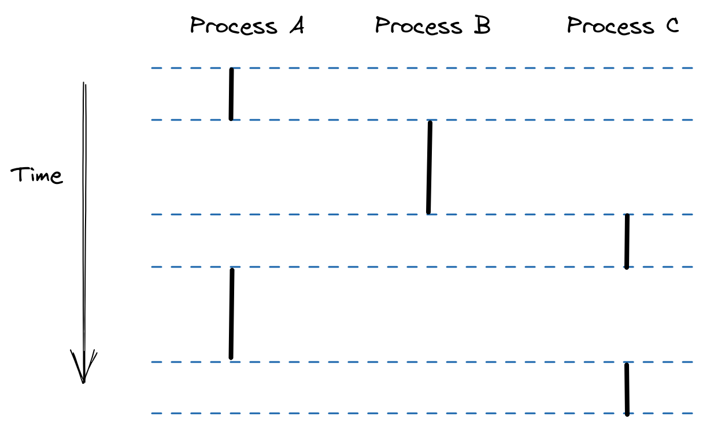

- 一个独立的逻辑控制流，好像程序在独占的使用CPU。
- 如果单步执行程序，可以看到一系列程序计数器(`PC`)的值，这个值唯一对应可执行文件中的指令，或者动态链接到程序的共享对象中的指令。这个`PC`值的序列就是**逻辑控制流**。
- {:height 388, :width 635}
	- 图中的进程是轮流使用处理器的，每个进程执行它的流的一部分，然后被抢占(暂时挂起)，然后轮到其他进程。