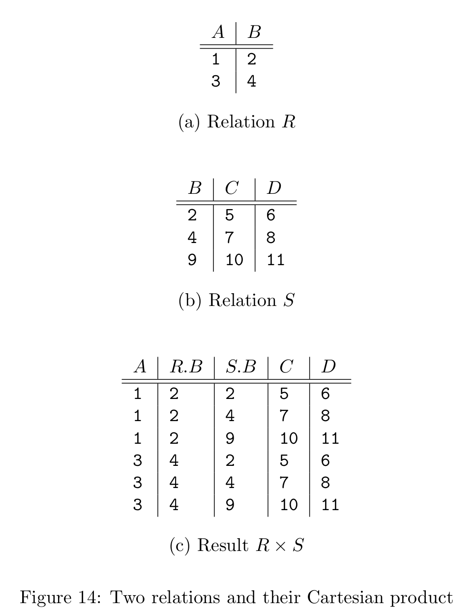
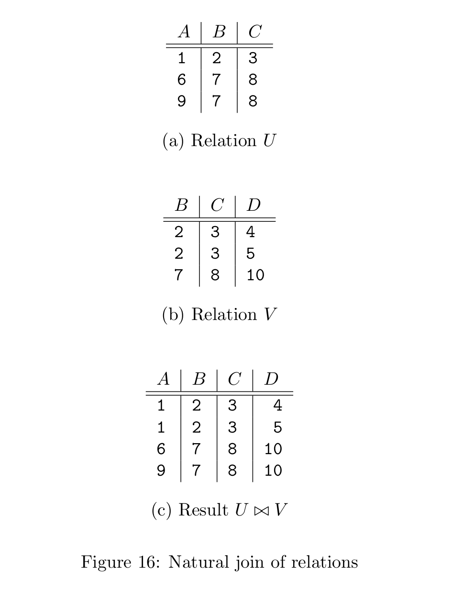
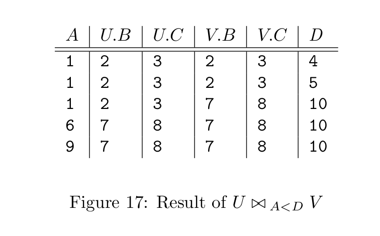

- ## Why do we need a special query language?
	- The relational algebra is useful because it's less powerful than C or Java. By limiting what we can say or do in out query language, we get two huge rewards.
		- Ease of programming
		- Make the compiler can produce highly optimized code.
- ## Relational algebra
	- ### _Atomic operands_
		- _Variables_ that stand for relations.
		- _Constants_, which are finite relations.
	- ### _Overview of operations_
		- _The usual set operations_
			- union
			- intersection
			- difference
		- _Remove parts of a relation_
			- Selection: It eliminates some rows(tuples)
			- Projection: It eliminates some columns.
		- _Combine the tuples of two relations_
			- Cartesion product: Pairs the tuples of two relations in
		- _Renaming: change the relation schema_
			- It does not affect the tuples of a relation, but changes the relation schema, i.e., the names of the attributes and/or the names of the relation itself.
- ## Set Operations
	- For relation $R$ and $S$:
		- $R$ and $S$ must have schemas with identical sets of attributes, and the types(domains) for each attribute must be the same in $R$ and $S$.
		- Before we compute the set-theoretic union, intersection, or difference of sets of tuples. the columns of $R$ and $S$ must be ordered so that the order of attributes is the same for both relations.
			- Use the renaming operator if two relations have same number of attributes with corresponding domains but use diffrent names for their attributes.
	- $R \cup S$: The _union_ of $R$ and $S$, is the set of elements that are in $R$ or $S$ or both.
	- $R \cap S$: The _intersection_ of $R$ and $S$, is the set of elements that are in both $R$ and $S$.
	- $R - S$: The _difference_ of $R$ and $S$, is the set of elements that are in $R$ but not in $S$.
- ## Projection
	- The _projection_ operator is used to produce from a relation $R$ a new relation that has only some of $R$'s columns.
		- The value of expression $\pi_{A_1,A_2,...,A_n}(R)$ is a relation that has only the columns for attributes $A_1,A_2,...,A_n$ of $R$.
		- The schema for the resulting value is the **set** of attributes $\{A_1,A_2,...,A_n\}$.
- ## Selection
	- The _selection_ operator, applied to a relation $R$, produces a new relation with a subset of $R$'s tuples.
		- The tuples in the resulting relation are those that satisfy some condition $C$ that involves the attributes of $R$. Use $\sigma_C(R)$ to denote this operation.
		- The schema for the resulting relation is the same as $R$'s relation.
	- ### Condition $C$
		- The operands in condition $C$ are either constants or attributes of $R$.
		- Apply $C$ to each tuple $t$ of $R$ by substituting, for each attribute $A$ appearing in condition $C$, the component of $t$ for attribute $A$. If after substituting for each attribute of $C$ the condition $C$ is true, then $t$ is one of the tuples that appear in the result of $\sigma_C(R)$.
- ## Cartesian Product
	- The _Cartesion product_ of two sets $R$ and $S$ is the set of pairs that cana be formed by choosing the first element of the pair to be any element of $R$ and the second any element of $S$.
		- The result of pairing a tuple from $R$ with a tuple from $S$ is a longer tuple, with one component for each of the components of the constituent tuples.
		- The relation schema for the resulting relation is the union of the schemas for $R$ and $S$.
			- If $R$ and $S$ should happen to have some attributes in common, we need to invent new names for at least one of each pair of identical attributes.
				- To disambiguate an attribute $A$ that is in the schemas of both $R$ and $S$, use $R.A$ for the attribute from $R$ and $S.A$ for the attribute from $S$.
	- {:height 498, :width 383}
- ## Natural Joins
	- The _natural join_ of two relations $R$ and $S$, denoted $R \bowtie S$. We pair only those tuples from $R$ and $S$ that agree in whatever attributes are common to the schemas of $R$ and $S$.
		- let $A_1,A_2,...A_n$ be all the attributes that are in both the schema of $R$ and the schema of $S$. Then a tuple $r$ from $R$ and a tuple $s$ from $S$ are successfully paired if and only if $r$ and $s$ agree on each of the attributes $A_1,A_2,...A_n$.
	- {:height 588, :width 460}
- ## Theta-Joins
	- The notaion for a theta-join of relations $R$ and $S$ based on condition $C$ is $R \bowtie_C S$. The result of this operation is constructed as follows:
		- Take the product of $R$ and $S$
		- Select from the product only those tuples that satisfy the condition $C$. As with the product operation, the schema for the result is the union of the schema of $R$ and $S$, with "$R.$" or "$S.$" prefixed to attributes if necessary to indicate from which schema the attribute came.
	- {:height 249, :width 417}
- ## Combining Operations to Form Queries
	- $$\pi_{title,year}(\sigma_{\text{length} \geq 100 \text{ AND }  \text{studioName} = \text{'Fox'}}(\text{Movies}))$$
- ## Naming and Renaming
	- Use $\rho_{S(A_1,A_2,...,A_n)}(R)$ to rename a relation. The resulting relation has exactly the same tuples as R, but the name of the relation is $S$.
- ## Relationships among operations
	- Some of the operation can be expressed in terms of other relation-algebra operations.
	- $$R \cap S = R-(R-S)$$
	- $$R \bowtie_C S = \sigma_C(R \times S)$$
- ## A linear notation for algebraic expressions
	- The notation shall use for assignment statement:
		- A relation name and parenthesized list of attributes for that relation.
		- The assignment symbol `:=`.
		- Any algebraic expression on the right.
	- **e.g.**
		- $R(t,y,l,i,s,p) := \sigma_{\text{length} \geq 100} (\text{Movies})$
		- $S(t,y,l,i,s,p) := \sigma_{\text{studioName} = \text{'Fox'}} (\text{Movies})$
		- $T(t,y,l,i,s,p) := R \cap S$
		- $\text{Answer}(\text{title}, \text{year}) := \pi_{t,y}(T)$
-