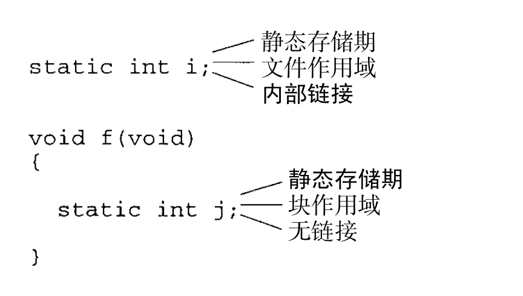

- ## 存储类型
	- C程序中的每个变量都具有以下3个性质:
		- _**存储期**_: 变量的存储期决定了为变量预留的内存被释放的时间
			- 具有自定存储期的变量在所属块被执行时获得内存单元，并在块终止时被释放。
			- 具有静态存储期的变量在程序运行期间占有同一个存储单元，也就允许变量无限期的保留它所占用的空间。
		- _**作用域**_: 变量的作用域其实就是变量名字的作用范围，是指可以通过名字引用变量的那部分程序文本。
			- 块作用域: 从声明的地方一直到所在块的末尾都可见。
			- 文件作用域: 从声明的地方一直到所在文件的末尾。
		- _**链接**_: 实际上是指变量名字的链接属性，它确定了程序的不同部分可以通过变量名字共享此变量的范围。
			- 具有**外部链接**的属性的名字的变量可以被程序中的几个文件共享。
			- 具有**内部链接**属性的名字的变量只能属于单独一个文件，但是此文件中的函数可以共享这个变量。
			- 具有**无链接**属性名字的变量属于单独一个函数，并且不能被共享。
	- 默认的存储期、作用域和链接都依赖于变量声明的位置。
		- 在块内部声明的变量通常具有自动存储期，它的名字具有块作用域，并且无链接。
		- 在程序的最外层(任意块外部)生命的变量具有静态存储期，它的名字具有文件作用域和外部链接。
		- {:height 203, :width 349}
	- ### `auto`
		- auto 存储类型只对属于块的变量有效。auto 变量具有自动存储期，它的名字具有块作用域，并且无链接。auto 存储类型几乎从来不用显式地指明，因为对于在块内部声明的变量，它是默认的。
	- ### `static`
		- `static`存储类型可以用于全不变量，而不用考虑变量声明的位置。
			- 当用在块外部时，单词`static`说明变量的名字具有内部链接。
			- 当用在块内部时，`static`把变量的存储期从自动的变成静态的。
			- {:height 260, :width 462}
	- ### `extern`
		- `extern`存储类型使几个源文件可以共享同一个变量。
		- `extern int i;`是对变量`i`的声明，因为可能在别的文件会有`i`的定义。`extern int i = 0;`是对变量`i`的定义，该定义仅有一次。
		- `extern`声明的变量始终具有静态存储期。变量的作用域依赖于声明的位置。如果声明在块内部，那么它的名字具有块作用域，否则具有文件作用域。
		- 如果变量在文件中较早的位置声明为`static`，那么它的名字具有内部链接；否则(通常情况下)，具有外部链接。
	- ### `register`
		- 声明变量具有`regsiter`存储类型就建议编译器把变量存储在寄存器中，而不像其他变量一样保留在内存中。编译器可以选择将`register`型变量存储在内存中。
		- `register`存储类型只对声明在块内的变量有效。`register`变量具有和`auto`变量一样的存储期、名字的作用域和链接。但因为声明没有存储在内存中，所以不能对该类型的变量进行取地址操作，即使编译器把它存储在内存中。
	- ### 函数的存储类型
		- 函数的声明也可以包含存储类型，但只有`extern`和`static`两个选项。
			- `extern`声明的函数具有外部链接
			- `static`声明的函数具有内部链接
- ## 类型限定符
	- ### `const`
		- `const`限定变量为只读。
		- `const`对象不可用于常量表达式。
			- ```c
			  const int n = 10;
			  int a[n]l 			/*** WRONG ***/
			  ```
		- #+BEGIN_TIP
		  没有绝对的原则说明何时使用`#define`或者`const`。建议对表示数或字符的常量使用`#define`。
		  #+END_TIP
-