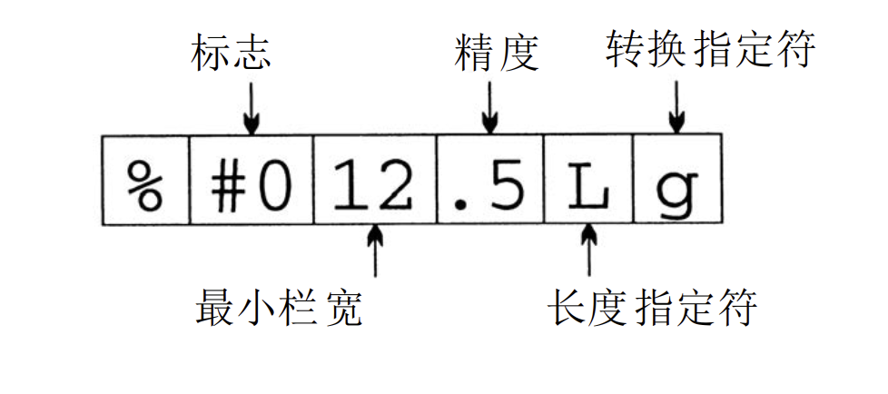
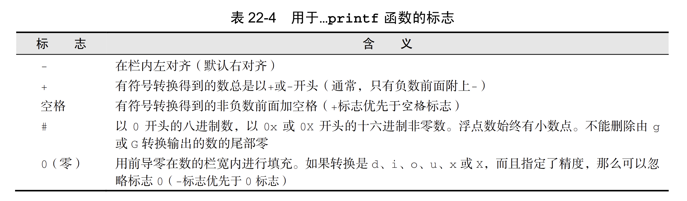
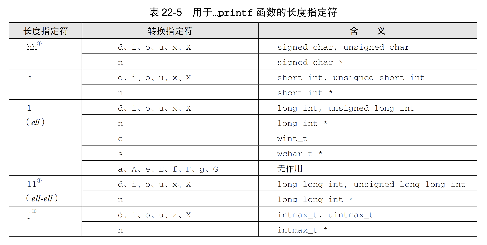
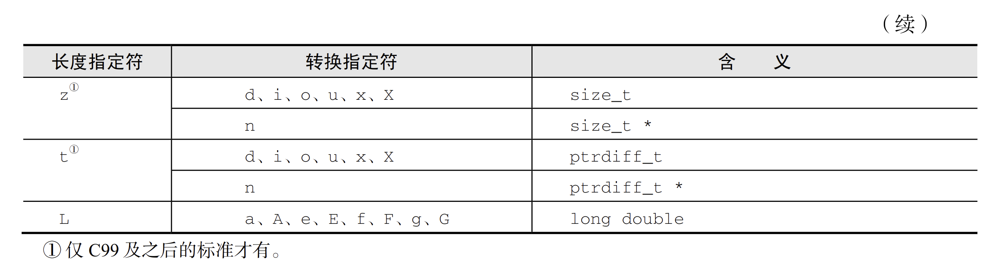
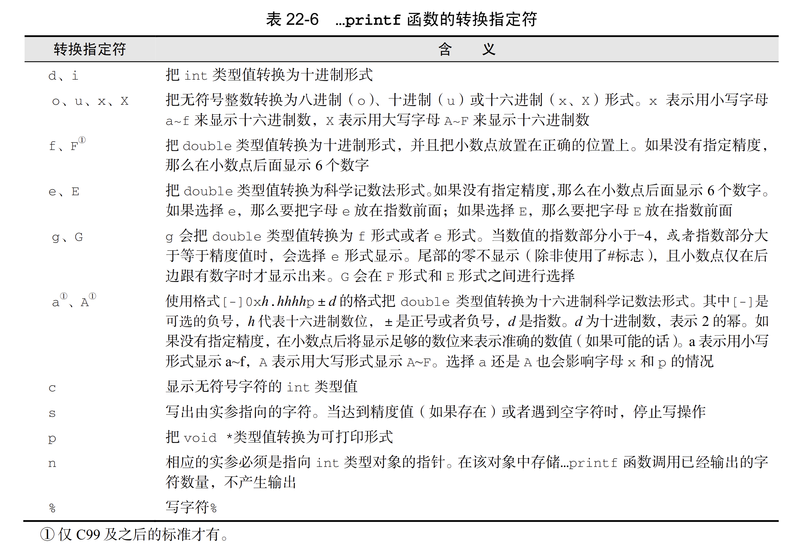

- **`...printf`函数**
	- ```C
	  int fprintf(FILE * restrict stream, const char * restrict format, ...);
	  int printf(const char * restrict format, ...);
	  ```
	- 返回值为写入的字符数，出错返回一个负值。
	- `fprintf`可以用于任何输出流
	- `...printf`函数的转换说明由字符`%`和跟随其后的最多5个不同的选项构成。
		- {:height 195, :width 481}
		- **标志**
			- 
		- **最小栏宽**(可选项)
			- 小于它则填充，大于则扩展
		- **精度**(可选项)
			- 如果转换指定符是`d i o u x X`，那么它表示最小位数，位数不够前面加0
			- 如果转换指定符是`a A e E f F`，那么它表示小数点后的位数
			- 如果转换指定符是`g G`，那么它表示有效数字的个数
			- 如果转换指定符是`s`，那么它表示最大字节数
			- `.`后为`*`，精度由下一个参数决定
			- 如果只有`.`，则精度为0
		- **长度指定符**(可选项)
			- 和转换指定符共同指定传入的实际参数的类型。
			- 
			- 
		- **转换指定符**
			- 
- **`...scanf`函数**
-