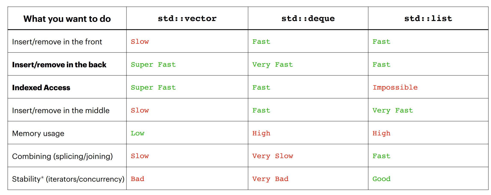

- ## Simple
	- `vector`: Adding and removing elements at end.
	- `deque`: adding and removing elements anywhere but end
	- `list`: adding and removing elements anywhere, but no random access.
	- `tuple`: diffrent data types, but immutable.
	- 
- ## Adaptors
	- Container adaptors provide a different interface for sequence containers.
	- You can choose a type of sequence as underlying container. `std::queue<int, std::deque<int>>`
	- Adaptors:
		- `stack`
		- `queue`
		- `priority_queue`