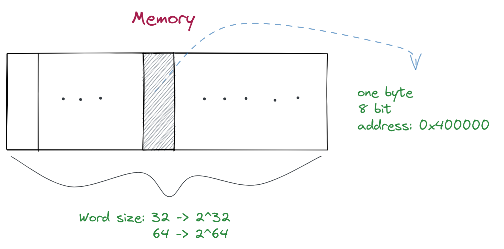

- ## 字长
	- #+BEGIN_QUOTE
	  字长并非一个十分严格的概念。在一个 CPU 指令集中，每条指令都可以处理长度不同的操作数。这时就把大多数指令能处理的最长长度但是又不花费额外周期的操作数长度称为字长。
	  
	  字长还经常会从地址总线宽度，数据总线宽度这类概念借用过来。
	  #+END_QUOTE
	- 字长指的是计算机中一个“字”的字节数，32位机器是4个字节，64位机器是8个字节。
	- 在内存中，最小的信息单位是字节`byte`，有8个位。每个在内存中的字节都有一个独立的地址
	- 内存的大小和字长相关, 字长32位的机器有`2^32`个字节的内存，也就是4GB。
	- {:height 286, :width 556}
- ## 字节顺序
	- 对一个多字节的程序对象，要知道它的存储建立在两个规则上：
		- **对象的位置**
			- 对象的位置在它所使用的字节中最小的那个地址
		- **对象如何排列**
			- [[Big Endian]]大端法
			- [[Little Endian]]小端法