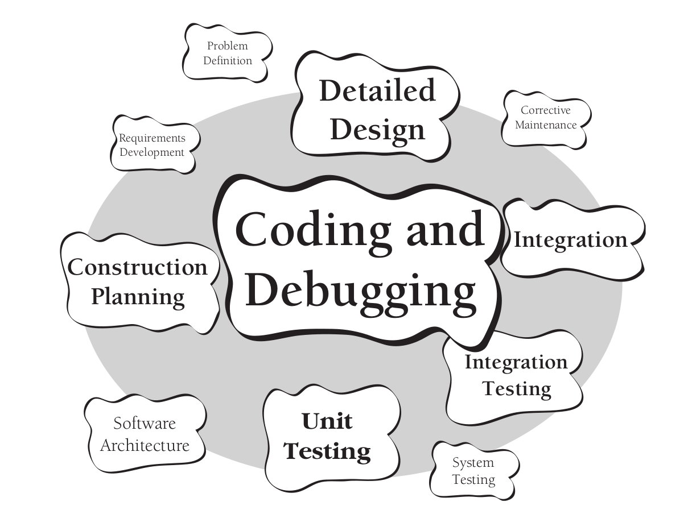

- ## 软件开发过程中的活动
	- 定义问题(Problem Definition)
	- 需求分析(Requirements Development)
	- 规划构建(Construction Planning)
	- 软件架构(Software Architecture)
	- 详细设计(Detailed Design)
	- 编码调试(Coding and Debugging)
	- 单元测试(Unit Testing)
	- 集成测试(Integration Testing)
	- 集成(Integration)
	- 系统测试(System Testing)
	- 保障维护(Corrective Maintenance)
	- 
	-
- ## 构建活动中的具体任务
	- 验证有关的基础工作已经完成，因此构建活动可以顺利地进行下去。
	- 确定如何测试所写的代码。
	- 设计并编写类和子程序。
	- 创建并命名变量和具名变量(named constant)
	- 选择控制结构，组织语句块。
	- 对你的代码进行单元测试和集成测试，并排除其中的错误。
	- 互相评审代码
	- 对代码进行格式化和注释
	- 将单独开发的多个软件组件集成为一体。
	- 代码优化
-