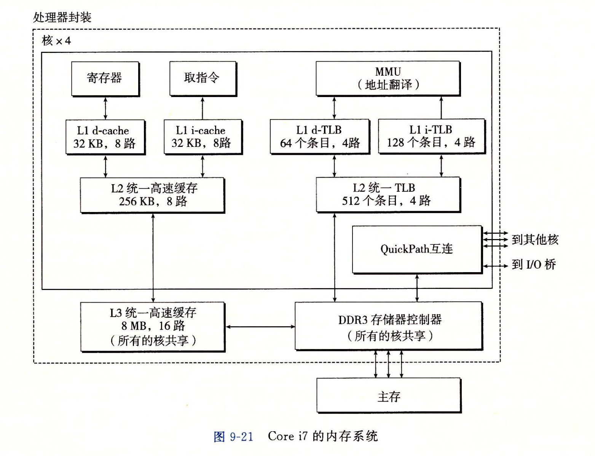
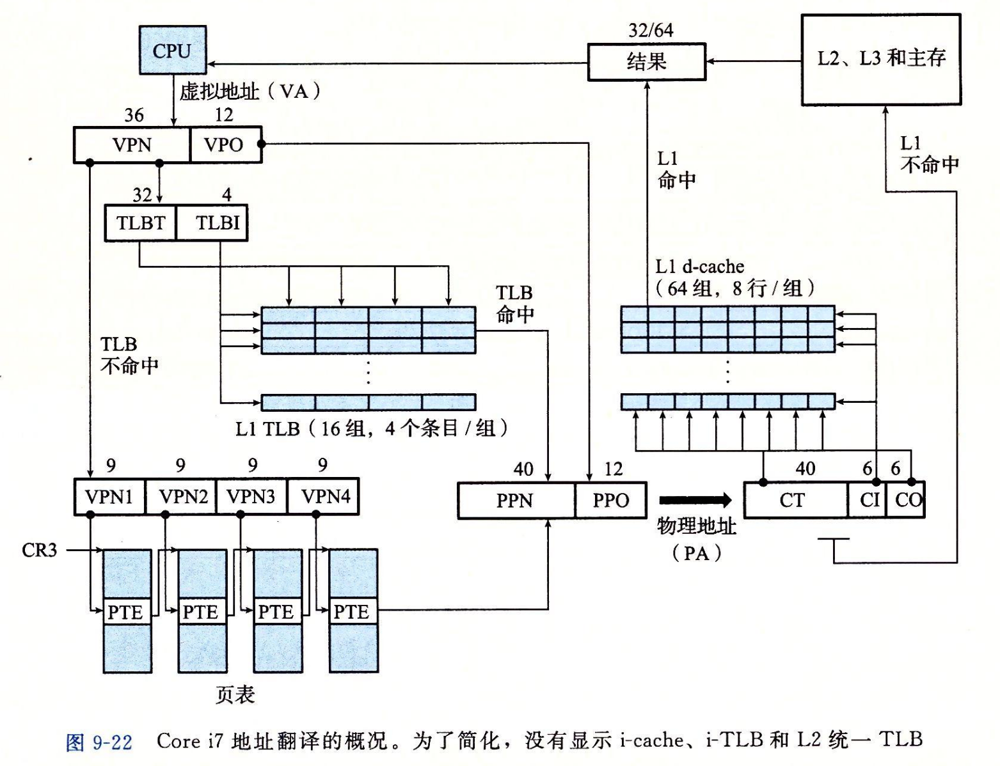
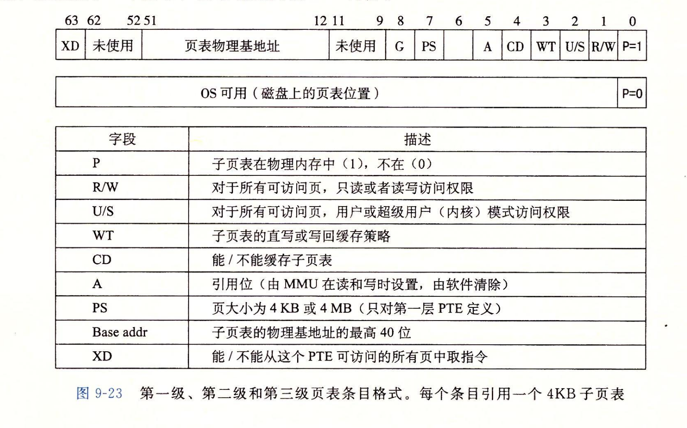
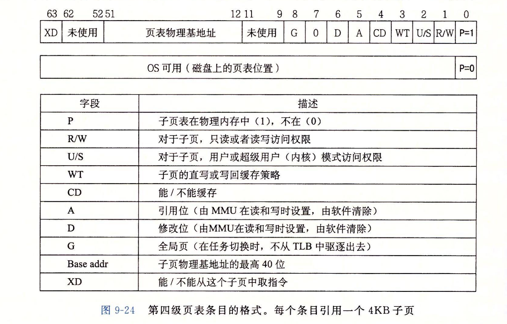
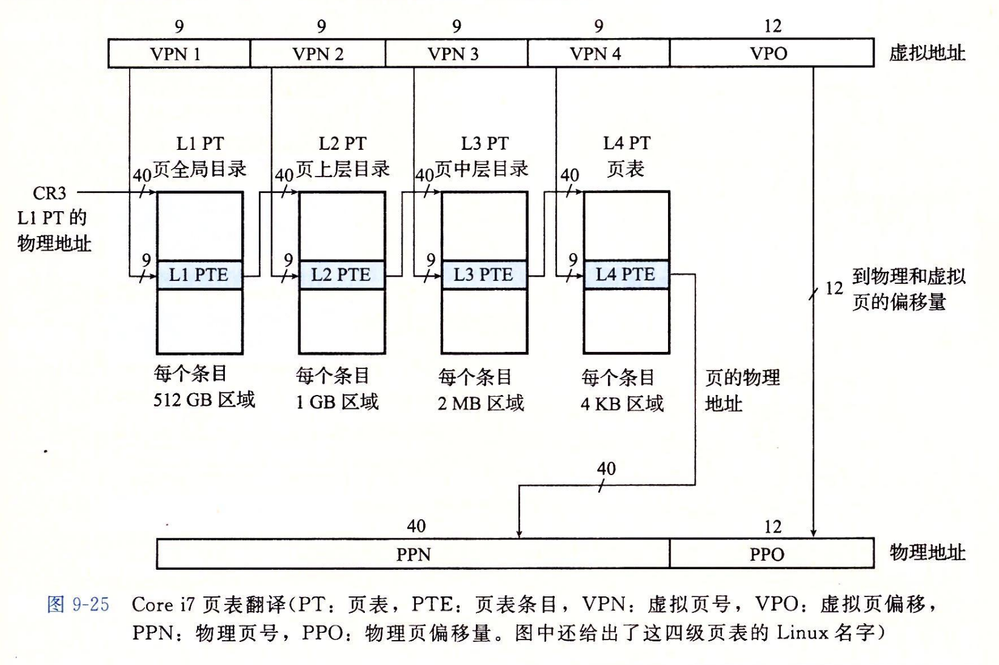

- ## Core i7 内存系统
	- 
	- 处理器封装包括4个核、一个所有核共享的L3高速缓存，一个DDR3内存控制器。
	- 每个核包含一个层次结构的TLB、一个层次结构的数据和指令高速缓存，以及一组基于QuickPath的点到点链路，可以与其他核和外部I/O桥直接通信。
	- TLB是虚拟寻址的，四路组相联。
	- L1、L2、L3是物理寻址的，块大小为64字节。
	- L1和L2是8路组相联的，L3是16组相联的。
	- 页大小被配置为4KB或4MB。Linux使用4KB的页。
- ## Core i7 地址翻译
	- 
	- Core i7采用四级页表层次结构。每个进程都有自己私有的页表层次结构。虽然Core i7体系结构允许页表换进换出，但已分配了的页相关联的页表都是驻留在内存中的。
	- CR3控制寄存器指向第一级页表(L1)的起始位置。CR3的值是每个进程上下文的一部分，每次切换上下文时，CR3的值都会被恢复。
	- ### 页表条目格式
		- 
			- 当P=1时，地址字段包含一个40位物理页号(PPN)，它指向适当的页表的开始处。要求页表4KB对齐。
		- 
			- 当P=1时，地址字段包括一个40位PPN，它指向物理内存中某一页的基地址。要求物理页4KB对齐。
			- PTE有三个权限位，`R/W`、`U/S `、`XD`。`XD`位可以禁止从某些内存页取指令。通过限制只能执行只读代码段，使得操作系统内核降低了缓冲区溢出攻击的风险。
			- 当MMU每翻译一个虚拟地址时，它会更新两个内核缺页处理程序会用到的位。
				- 每访问一个页时，MMU设置A位。内核可以用这个引用位实现它的页替换算法。
				- 每次对一个页进行了写之后，MMU会设置D位。修改位告诉内核在复制替换页之前必须写回牺牲页。
				- 内核可以调用一条特殊的指令来清除引用位或修改位。
	- ### 地址翻译
		- 
		- 36位VPN被划分成四个9位的片，每个片被用作到一个页表的偏移量。
-