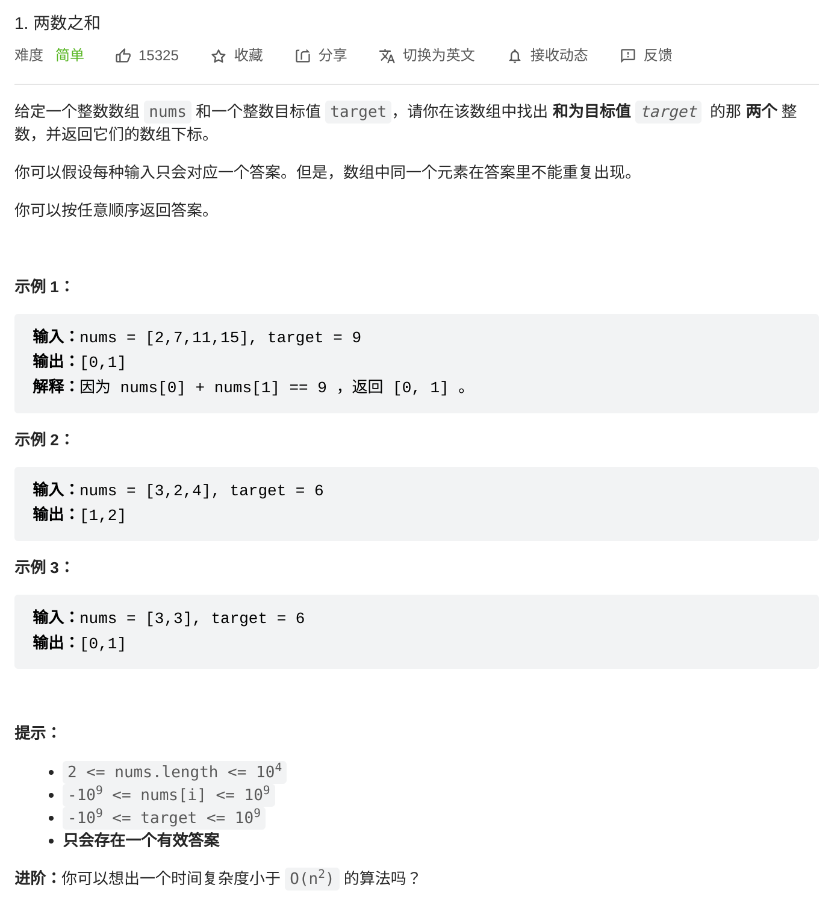

- ## 题目
	- 
- ## idea
	- 暴力
		- 双重循环遍历数组，在所有的匹配里寻找答案。复杂度为$O(n^2)$
	- 缓存
		- 将已遍历过的元素缓存在一个数据结构中。看即将遍历的元素是否会和已缓存的其中一个元素配对。
		- ```
		  Map m
		  for i in nums 
		  	a = nums[i]
		      b = target-a
		  	if (m contains b)
		      	return i,m[b]
		      m[a] = i
		  ```
- ## Code
	- Java
		- ```Java
		  class Solution {
		      public int[] twoSum(int[] nums, int target) {
		          int[] res = new int[2];
		          HashMap<Integer, Integer> map = new HashMap<>();
		          for (int i = 0; i < nums.length; i++) {
		              res[0] = i;
		              if (map.containsKey(target-nums[i])) {
		                  res[1] = map.get(target-nums[i]);
		                  return res;
		              }
		              map.put(nums[i], i);
		          }
		          return res;
		      }
		  }
		  ```
	- Go
		- ```Go
		  func twoSum(nums []int, target int) []int {
		      m := make(map[int]int)
		      res := make([]int, 2)
		      for i, v := range nums {
		          res[0] = i
		          if elem, ok := m[target-v]; ok {
		              res[1] = elem
		              return res
		          }
		          m[v] = i;
		      }
		      return res
		  }
		  ```
	- C++
		- ```C++
		  class Solution {
		  public:
		      vector<int> twoSum(vector<int>& nums, int target) {
		          map<int, int> m;
		          vector<int> res;
		          for (int i = 0; i < nums.size(); i++) {
		              int num  = nums[i];
		              if (m.count(target-num) == 1) {
		                  res.push_back(i);
		                  res.push_back(m[target-num]);
		                  return res;
		              }
		              m[num] = i;
		          }
		          return res;
		      }
		  };
		  ```