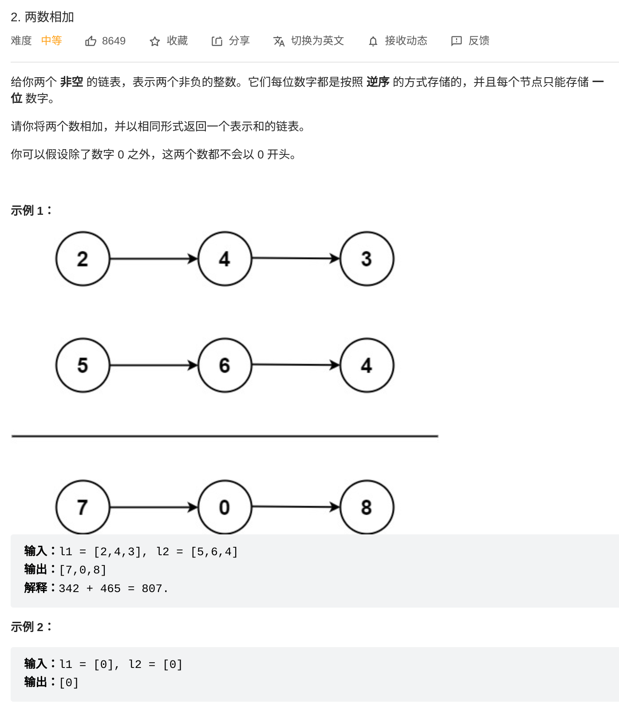

- ## 题目
	- 
- ## idea
	- 两个链表代表的数字都是从低位到高位。逐个相加即可，数字如果不一样长则对超出的忽略。
	- 注意进位。
- ## Code
	- Java
		- ```java
		  /**
		   * Definition for singly-linked list.
		   * public class ListNode {
		   *     int val;
		   *     ListNode next;
		   *     ListNode() {}
		   *     ListNode(int val) { this.val = val; }
		   *     ListNode(int val, ListNode next) { this.val = val; this.next = next; }
		   * }
		   */
		  class Solution {
		      public ListNode addTwoNumbers(ListNode l1, ListNode l2) {
		          ListNode res = new ListNode(0);
		          boolean empty = true;
		  
		          int p = 0;		//进位
		          ListNode pointer = res;
		          while (l1 != null || l2 != null || p > 0) { // 若不判断p，则会在l1,l2都为null且需要进位时出现空指针异常
		              int a = l1 == null? 0 : l1.val;
		              int b = l2 == null? 0 : l2.val;
		  
		              int curr = a + b + p;
		              if (curr >= 10) {
		                  p = curr / 10;
		                  curr = curr % 10;
		              } else {
		                  p = 0;
		              }
		  
		              if (empty) {
		                  pointer.val = curr;
		                  empty = false;
		              } else {
		                  pointer.next = new ListNode(curr);
		                  pointer = pointer.next;
		              }
		              l1 = l1 == null? null: l1.next;
		              l2 = l2 == null? null: l2.next;
		          }
		          
		          return res;
		      }
		  
		  }
		  ```
	- C++
		- ```C++
		  /**
		   * Definition for singly-linked list.
		   * struct ListNode {
		   *     int val;
		   *     ListNode *next;
		   *     ListNode() : val(0), next(nullptr) {}
		   *     ListNode(int x) : val(x), next(nullptr) {}
		   *     ListNode(int x, ListNode *next) : val(x), next(next) {}
		   * };
		   */
		  class Solution {
		  public:
		      ListNode* addTwoNumbers(ListNode* l1, ListNode* l2) {
		          ListNode* res = new ListNode(0);
		  
		          int p = 0;
		          bool empty = true;
		          ListNode* resp = res;
		          while (l1 != nullptr || l2 != nullptr || p > 0) {
		              int a = l1? l1->val: 0;
		              int b = l2? l2->val: 0;
		              int curr = a + b + p;
		  
		              if (curr >= 10) {
		                  p = curr / 10;
		                  curr = curr % 10;
		              } else {
		                  p = 0;
		              }
		  
		              if (empty) {
		                  resp->val = curr;
		                  empty = false;
		              } else {
		                  resp->next = new ListNode(curr);
		                  resp = resp->next;
		              }
		              l1 = l1? l1->next : nullptr;
		              l2 = l2? l2->next : nullptr;
		          }
		  
		          return res;
		      }
		  };
		  ```
		- `l1 != nullptr`的判断条件可以改成判断`l1`
		- 取名限制了想象力，`res`可以改名作为守卫节点，真正的`res`可以作为守卫节点的`next`。这样做就不用在循环体里面进行`empty`判断。
	- Go
		- ```go
		  /**
		   * Definition for singly-linked list.
		   * type ListNode struct {
		   *     Val int
		   *     Next *ListNode
		   * }
		   */
		  
		  func nilReturnVal(l *ListNode) int {
		      if l == nil {
		          return 0
		      }
		      return l.Val
		  }
		  
		  func nilReturnNext(l *ListNode) *ListNode {
		      if l == nil {
		          return nil
		      }
		      return l.Next
		  }
		  
		  func ifListNode(isTrue bool, a, b *ListNode) *ListNode {
		      if isTrue {
		          return a
		      }
		      return b
		  }
		  
		  func addTwoNumbers(l1 *ListNode, l2 *ListNode) *ListNode {
		      var sentinel = ListNode{-1, nil}
		      var po = &sentinel
		      carry := 0;
		      for l1 != nil || l2 != nil || carry != 0 {
		          a := nilReturnVal(l1)
		          b := nilReturnVal(l2)
		          curr := a + b + carry
		          if curr%10 >= 0 {
		              carry = curr / 10
		          } else {
		              carry = 0
		          }
		          curr = curr%10
		          var next = ListNode{curr, nil}
		          po.Next = &next
		          po = po.Next
		          l1 = nilReturnNext(l1)
		          l2 = nilReturnNext(l2)
		      }
		      return sentinel.Next
		  }
		  ```