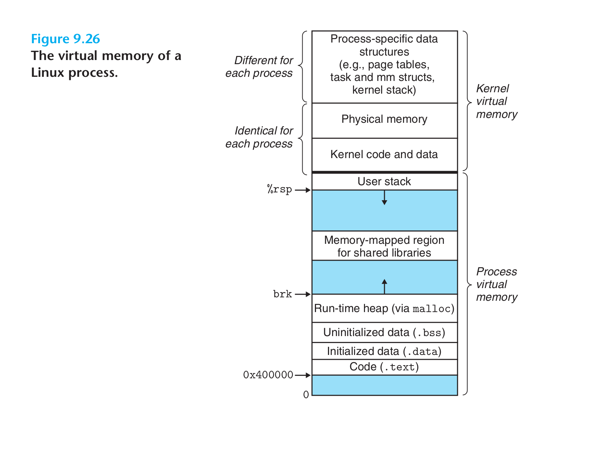
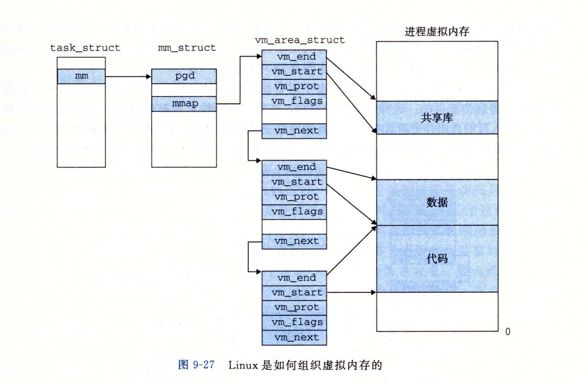
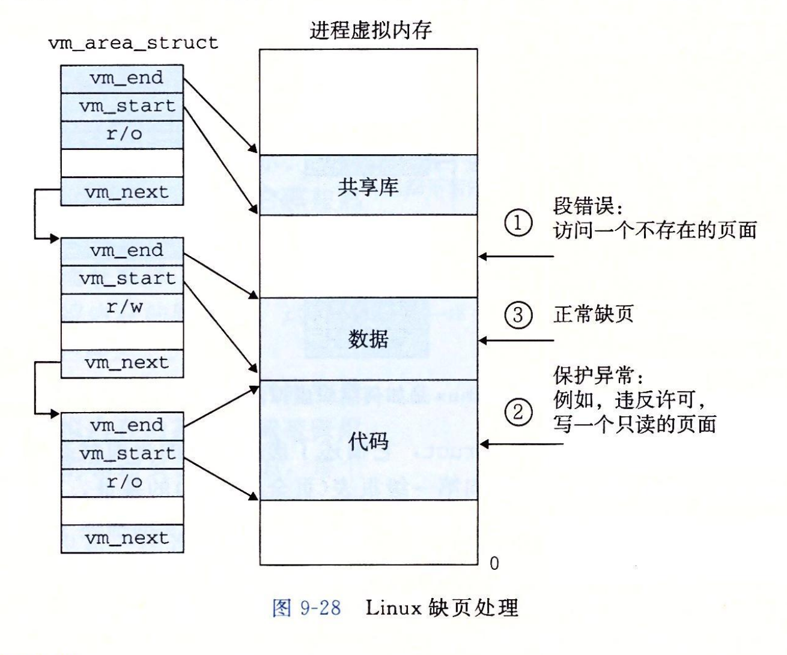

- 
- Linux为每个进程维护一个单独的虚拟地址空间。
- 内核虚拟内存包含内核中的代码和数据结构。内核虚拟内存的某些区域被映射到所有进程共享的物理页面，例如，每个进程共享内核的代码和全局数据结构。Linux也将一组连续的虚拟页面映射到相应的一组连续的物理页面，为内核提供一种便利的方法来访问物理内存中的任何特定的位置。
- 内核虚拟内存的其他区域包含每个进程都不相同的数据，比如页表、内核在进程的上下文中执行代码时使用的栈。
- ## Linux虚拟内存区域
	- Linux将虚拟内存组织成一些**区域(段)**的集合。一个区域就是已经存在着的(已分配的)虚拟内存的连续片(chunk)，这些页以某种方式相关联。例如，代码段、数据段、堆、共享库段，以及用户栈都是不同的区域。
	- 每个存在的虚拟页面都保存在某个区域中，而不属于某个区域的虚拟页是不存在的，并且不能被进程引用。
	- 区域是一个重要的概念，它允许地址空间有间隙。
- ## 内核数据结构
	- 
	- 内核为系统中的每个进程维护一个单独的任务结构(`task_struct`)。任务结构中的元素包含或者指向内核运行该进程所需要的所有信息(PID、指向用户栈的指针、可执行目标文件的名字，以及程序计数器)。
	- `task_struct`中的一个条目指向`mm_struct`，它描述了虚拟内存的当前状态。
		- pgd指向第一级页表的基址
		- mmap指向一个`vm_area_structs`的列表。其中每个`vm_area_structs`都描述了当前虚拟地址空间的一个区域。当内核运行这个进程时，就将pgd存放在CR3控制寄存器中。
			- 区域结构的字段
				- `vm_start`: 指向这个区域的起始处。
				- `vm_end`: 指向这个区域的结束处。
				- `vm_prot`: 描述这个区域内包含的所有页的读写许可权限。
				- `vm_flags`: 描述这个区域内的页面是与其他进程共享的，还是这个进程私有的。
				- `vm_next`: 指向下一个区域结构。
- ## 缺页异常处理
	- {:height 621, :width 735}
	- 当MMU翻译虚拟地址A时，触发了一个缺页。缺页处理程序执行以下步骤:
		- 1) 虚拟地址A是合法的吗？即A在某个区域结构定义的区域内吗？
			- 缺页处理程序搜索区域结构的链表，把A和每个区域结构的`vm_start`和`vm_end`作比较。如果指令是不合法的，缺页处理程序触发一个段错误，终止进程。图中标识为“1”。
		- 2) 试图进行的内存访问是否合法？即进程是否有读、写或者执行这个区域内页面的权限？
			- 如果试图进行的访问是不合法的，缺页处理程序触发一个保护异常，从而终止进程。图中标识为“2”。
		- 3) 此刻，内核知道是对一个合法地址的合法内存访问。它将选择一个牺牲页面，如果这个牺牲页面被修改过，那么就将它交换出去，换入新的页面并更新页表。当缺页处理程序返回时，CPU重新启动引起缺页的指令，这条指令将再次发送A到MMU。
	-