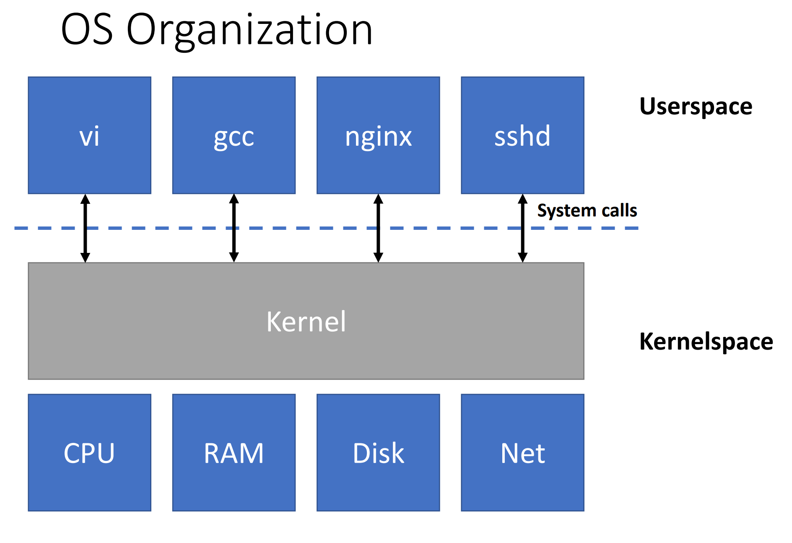

- ## O/S purpose
	- Abstract the hardware for convenience and portability.
	- Multiplex the hardware among many applications.
	- Isolate applications in order to contain bugs.
	- Allow Sharing among cooperating applications.
	- Control sharing for security.
	- Don't get in the way of high performance.
- ## O/S organization
	- 
- ## O/S abstractions
	- Process
	- Memory allocation
	- File contents
	- File names, directories
	- Access control (security)
	- Many others: users, IPC, network sockets, time.
- ## O/S  kernel interface
	- System Calls.
	- 
-