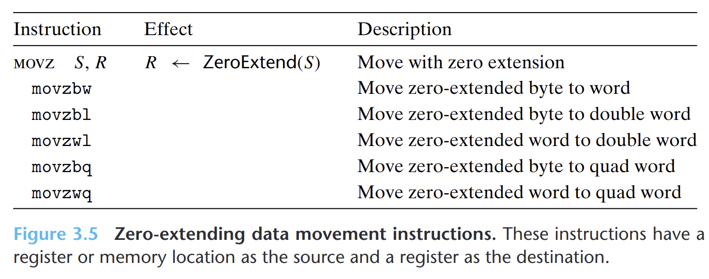
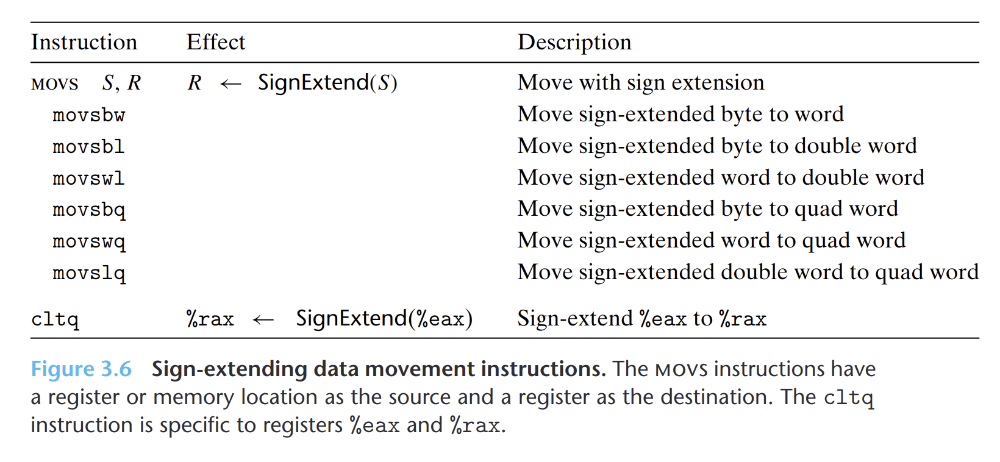

- 将较小的源(寄存器或内存中)复制到较大的目的(寄存器)，`movz`中的指令把目的中剩余的字填充为**0**，而`movs`类中的指令通过**符号扩展**来进行扩充。
- 每条指令的名字的最后两个字符都是大小指示符。第一个字符指定源的大小，第二个指明目的的大小。
- `cltq`指令没有操作数。它总是以`%eax`作为源，`%rax`作为符号扩展结构的目的。
- {:height 251, :width 619}
- {:height 332, :width 716}