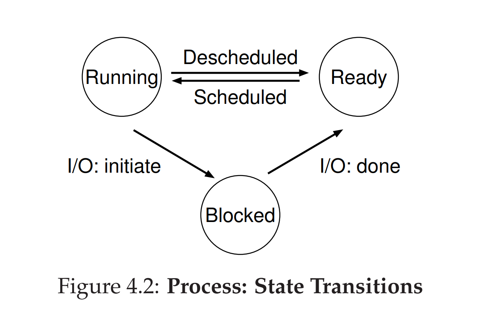

- How to provide the illusion of many CPUs?
	- **Time-sharing**: Running one process, then stopping it and running another, and so forth, the OS can promote the illusion that many virtual CPUs exist when in fact there is only one physical CPU.
	- #+BEGIN_NOTE
	  **Mechanisms**: Low-level methods or protocols that implement a nedded piece of functionality. E.g. time-sharing, context swich.
	  **Polycies**: Algorithms for making some kind of decision within the OS. E.g. Scheduling policy.
	  #+END_NOTE
	- #+BEGIN_TIP
	  **Separate policy and mechanism.**
	  Mechanism provides the answer to a _how_ question.
	  Policy provides the answer to a _which_ question.
	  #+END_TIP
- **Process**: The abstraction of a running program.
- **Process API**
	- Create
	- Destroy
	- Wait
	- Miscellaneous Control
	- Status
- **Process States**
	- {:height 285, :width 442}
	- Running
	- Ready
	- Blocked
- **Data Structure to track process information in xv6**
	- ```C
	  // the registers xv6 will save and restore
	  // to stop and subsequently restart a process
	  struct context {
	  	int eip;
	  	int esp;
	  	int ebx;
	  	int ecx;
	    	int edx;
	  	int esi;
	  	int edi;
	  	int ebp;
	  };
	  // the different states a process can be in
	  enum proc_state { UNUSED, EMBRYO, SLEEPING,
	  					RUNNABLE, RUNNING, ZOMBIE };
	  // the information xv6 tracks about each process including its register context and state
	  struct proc {
	  	char *mem; 					// Start of process memory
	  	uint sz; 					// Size of process memory
	    	char *kstack;				// Bottom of kernel stack
	  								// for this process
	  	enum proc_state state; 		// Process state
	  	int pid; 					// Process ID
	  	struct proc *parent; 		// Parent process
	    	void *chan; 				// If !zero, sleeping on chan
	  	int killed; 				// If !zero, has been killed
	  	struct file *ofile[NOFILE]; // Open files
	  	struct inode *cwd; 			// Current directory
	  	struct context context; 	// Switch here to run process
	  	struct trapframe *tf; 		// Trap frame for the current interrupt								
	  };
	  ```