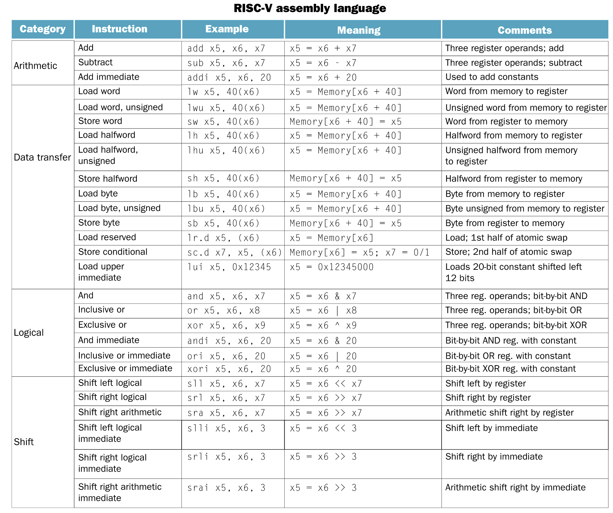

- 
- **word:** A natural unit of access in a computer, usually a group of 32 bits; corresponds to the size of a register in the RISC-V architecture.
- **doubleword:**  Another natural unit of access in a computer, usually a group of 64 bits.
- There are only 32 registers. This confoms to the second principle of [[Hardware Design Principle]].
	- A very large number registers may increase the clock cycle time simply because it takes electronic signals longer when they must travel farther.
- {:height 532, :width 628}
- 
- RISC-V requires every **arithmetic** instruction to have **three operands**, no more and no less. This conforms to the philosophy of keeping the hardware simple:
	- Hardware for a variable number of operands is complicated than hardware for a fixed number.
		- It illustrate the first of three [[Hardware Design Principle]].
- **Memory Operands**
	- `40(x6)` means `Memory[x6 + 40]`. 40 means 40 bytes.
	-