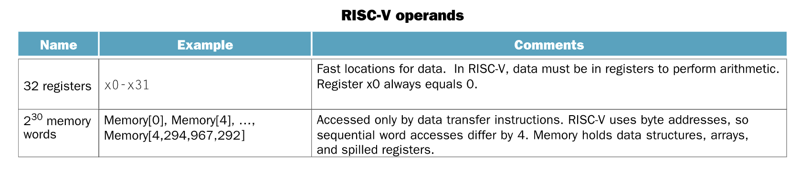

- 
- **word:** A natural unit of access in a computer, usually a group of 32 bits; corresponds to the size of a register in the RISC-V architecture.
- **doubleword:**  Another natural unit of access in a computer, usually a group of 64 bits.
- There are only 32 registers. This confoms to the second principle of [[Hardware Design Principle]].
	- A very large number registers may increase the clock cycle time simply because it takes electronic signals longer when they must travel farther.