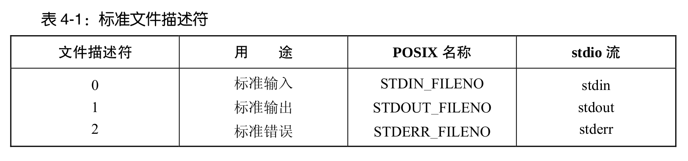
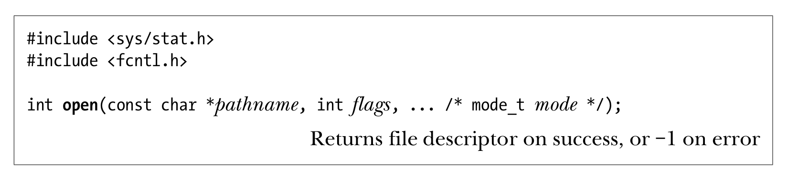

- ## 概述
	- 所有执行I/O操作的系统调用都以文件描述符，一个非负整数，来指代打开的文件。它可以表示所有类型的已打开文件，包括管道(pipe)、FIFO、socket、终端、设备和普通文件。每个进程有它自己的一套文件描述符。
	- 大多数程序都能够使用3种标准的文件描述符，继承自shell。
		- 
- ## 系统调用
	- `fd = open(pathname, flags, mode)`
		- 
		- `flags`指定打开的方式
		- `mode`指定创建文件的访问权限，如果`open`没有创建文件，`mode`可以省略。
	- `numread = read(fd, buffer, count)`
		- 
		- 调用从`fd`所指代的打开文件中读取至多`count`字节的数据，并储存到`buffer`中。返回值是实际读取到的字节数。如果再无字节可读，则返回值为0。
	- `numwritten = write(fd, buffer, count)`
		- 
		- 从`buffer`中读取多达`count`字节的数据写入由`fd`所指代的已打开文件。返回值是写入字节数，它有可能小于`count`。
	- `status = close(fd)`
		- 
		- 在所有输入/输出才做完成后，调用`close()`，释放文件描述符`fd`以及与之相关的内核资源。
	-