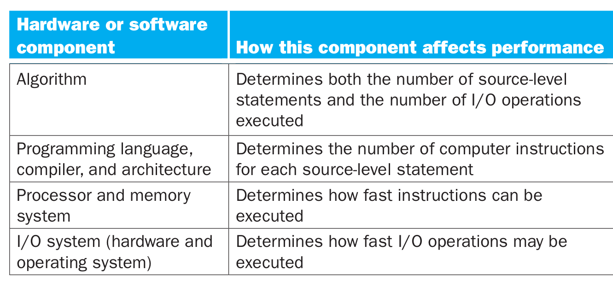

- The performance of a program depends on a combination of
	- the effectiveness of the algorithms used in the program,
	- the software systems used to create and translate the program into machine code
	- the effectiveness of the computer in executing those instructions.
- {:height 267, :width 566}
-