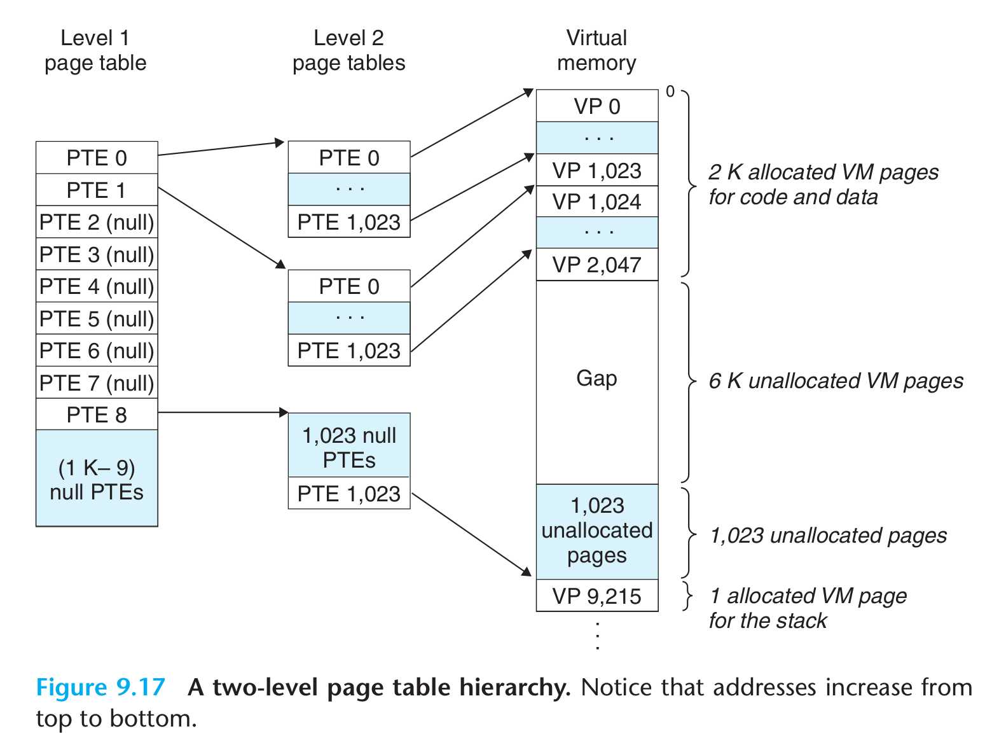
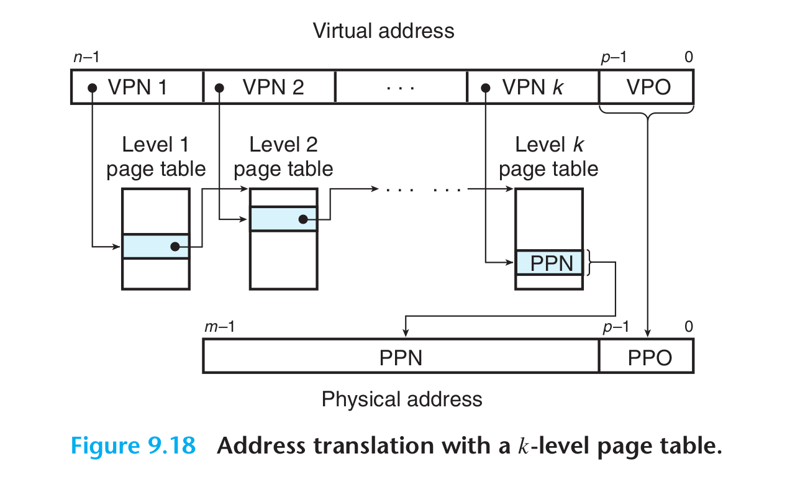

- ## 二级页表
	- 假设一个32位机器，页大小为4KB，页表条目是4字节。内存的前2000个页面分配了代码和数据，接下来的6K个页面还未分配，在接下来的1023个页面也未分配，接下来的一个页面分配给了用户栈。
		- {:height 430, :width 573}
		- 一级页表中的每个PTE负责映射虚拟地址空间中一个4MB的片(chunk)。每一个片由1024个连续的页面组成。假设地址空间是4GB，1024个PTE已经足够覆盖整个地址空间了。
		- 如果片$i$中的每个页面都为空，那么一级PTE$i$就为空。如果片$i$至少又一个页是分配的，那么一级PTE$i$就指向一个耳机页表的基址。
		- 二级页表中的每个PTE都负责映射一个4KB的虚拟内存页面。
	- ### 作用
		- 如果一级页表中的一个PTE是空的，那么相应的二级页表就不存在。
		- 只有一级页表总是出存在内存中。
- ## K级页表
	- 虚拟地址被划分为$k$个VPN和1个VPO。
	- 
	- 每个VPN$i$都是一个到第$i$级页表的索引，其中$1 \leq i \leq k$。第$j$级页表中的每个PTE，$1 \leq j \leq k-1$，都指向第$j+1$级页表的基址。第$k$级页表中的每个PTE包含某个物理页的PPN。
	- 为了构造物理地址，在能够确定PPN之前，MMU必须访问k个PTE。对于只有一级的页表结构，PPO和VPO是相同的。
	- TLB可以帮助提高访问k个PTE的速度。