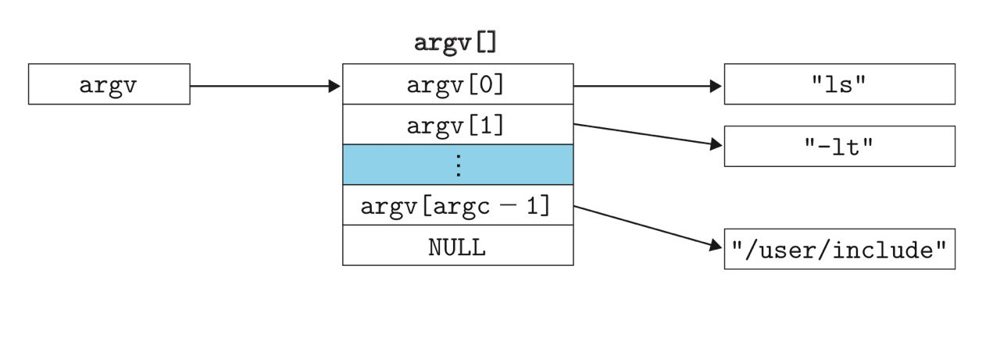
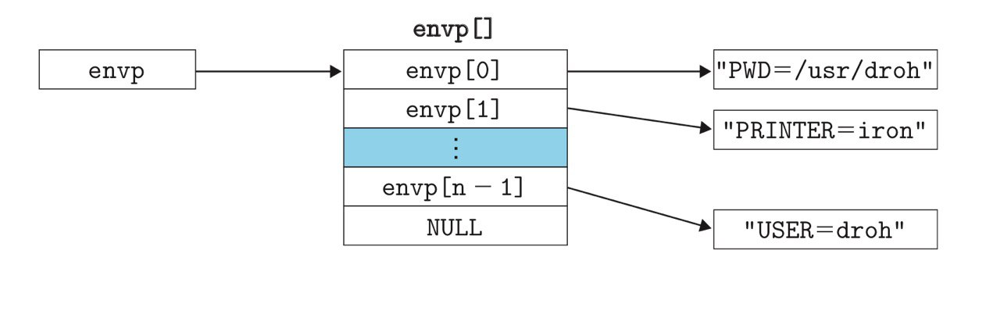
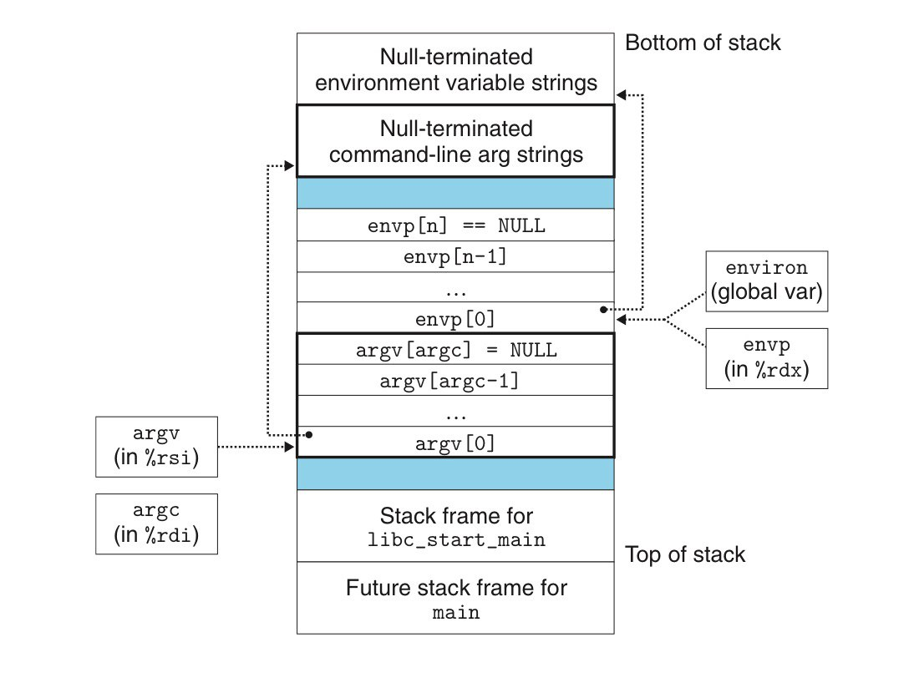

- `execve`函数在当前进程的上下文中加载并运行一个程序。
- **概述**
	- 只有当出现错误时才返回调用程序，否则从不返回。
	- ```C
	  #include <unistd.h>
	  
	  // 成功，不返回。错误，返回-1
	  int execve(const char *filename, const char *argv[], const char *envp[]);
	  ```
		- `filename` 可执行目标文件，`argv` 参数列表，`envp` 环境变量列表
			- `argv`指向一个以`NULL`结尾的指针数组，其中每个指针都指向一个字符串。
				- {:height 148, :width 460}
			- `envp`指向一个以`NULL`结尾的指针数组，每个指针指向一个环境变量字符串，每个串都是形如`name=value`的值对。
				- {:height 143, :width 473}
- **行为**
	- 在`execve`加载了`filename`后，它调用7.9节描述的启动代码。启动代码设置栈，并将控制传递给新程序的主函数。
		- 主函数原型
			- ```C
			  int main(int argc, char **argv, char **envp);
			  
			  or
			  
			  int main(int argc, char *argv[], char *envp[]);
			  ```
	- 当`main`开始执行时，用户栈的组织如下所示。
		- {:height 390, :width 516}
		- 栈顶在下，栈底在上。从栈底到栈顶：
			- 首先是参数和环境字符串
			- 然后是以`null`为结尾的`envp[]`指针数组，其中每个指针指向栈中的一个环境变量字符串。
				- 全局变量`environ`指向指针中的第一个`envp[0]`
			- 然后是以`null`为结尾的`argv[]`数组，其中每个元素都指向栈中的一个参数字符串。
			- 栈顶是系统启动函数`libc_start_main`的栈帧。
- **操作环境数组**
	- ```C
	  #incldue <stdlib.h>
	  
	  // 在环境变量中寻找“name=value"的字符串，找到则返回指向value的指针
	  char *getenv(const char *name);
	  
	  // 如果包含`name=value`的字符串，且overwrite=1，则用newvalue代替oldvalue。
	  // 如果name不存在，将新的值对添加到数组中。
	  int setenv(const char *name, const char *newvalue, int overwrite);
	  
	  // 如果包含`name=value`的字符串，就将其删除。
	  void unsetenv(const  char *name);
	  ```
	-