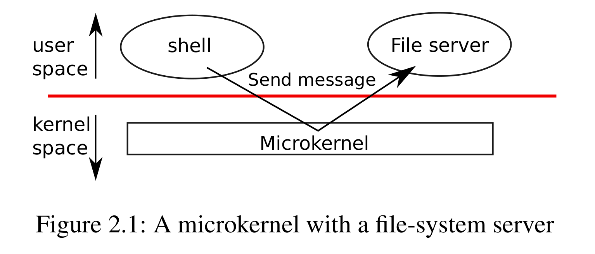

- A key design question is what part of the operating system should run in supervisor mode.
- ## Monolithic kernel
	- The entire operating system resides in the kernel, all system calls run in supervisor mode.
	- _Benifit_
		- OS designer doesn't have to decide which part of the operating system doesn't need full hardware privilege.
		- It's easy for different parts of the operating system to cooperate.
	- _Downside_
		- The interface between different parts of the operating system are often complex, it's easy to make mistakes.
		- A mistake is fatal, an error in supervisor mode will often cause the kernel to fail.
- ## Microkernel
	- To reduce the risk of mistakes in the kernel, OS designers minimize the amount of operating system code that runs in supervisor mode, and execute the bulk of the operating system in user mode.
	- 
	- The kernel interface consist of a few low-level functions for starting applications, sending messages, accessing device hardware.