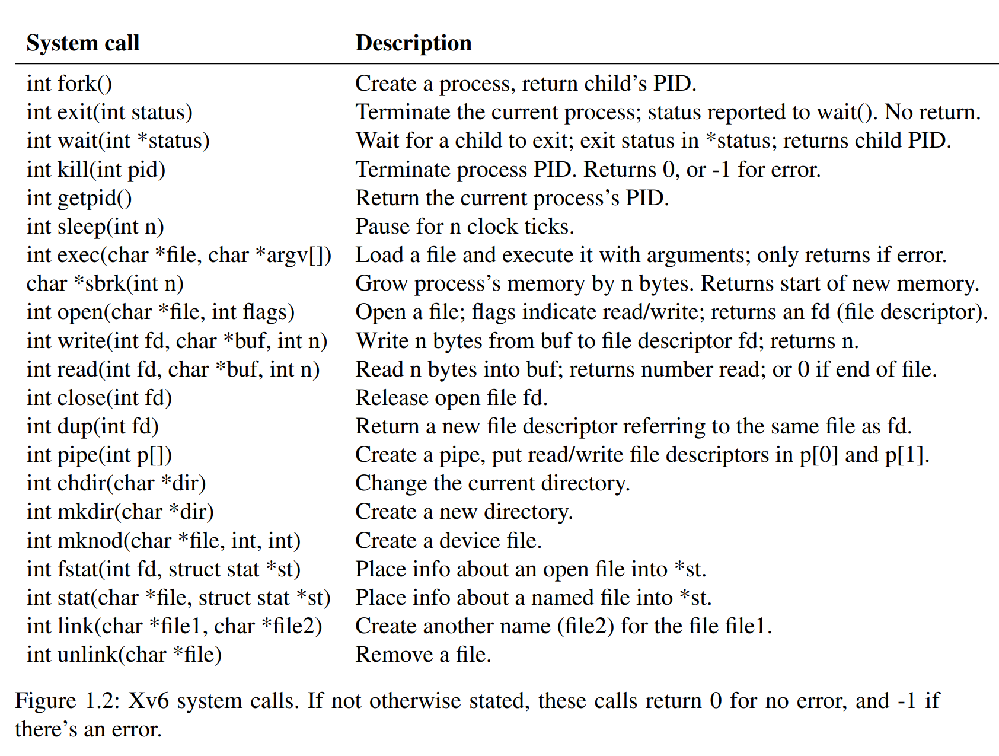

- 
- ### `fork()`
	- In new process returns 0.
	- In parent process returns PID.
- ### `int exit(int status)`
	- Make the calling process to stop executing and to release resources such as memory and open files.
	- For `status`, 0 indicates success, 1 indicates failure.
- ### `int wait(int *status)`
	- It returns the PID of an exited/killed child of current process, and copy the exit status to the argument`*status`
	- If none of the caller's children has exited, `wait` waits for one to do so.
	- If the caller has no children, `wait` immediately returns -1.
	- If the parent don't care about child exit status, just pass `0`.
- ### `int exec(char *file, char *argv[])`
	- It replaces the calling process's memory with a new memory image loaded from a file stored in the file system.
	- The file must have a particular format, which specifies which part of the file holds instructions, which part is data, at which instruction to start. xv6 uses the ELF format.
- ### `int read(int fd, char *buf, int n)`
	- Each file descriptor that refers to a file has an offset associated with it. `read` reads data from current file offset and then advances that offset by the number of bytes read: a subsequent `read` will return the bytes following the ones returned by the first `read`
- ### `int write(int fd, char *buf, int n)`
	- `write` writes `n` bytes from buf to the file descriptor `fd` and returns the number of bytes written. Fewer than `n` bytes are written only when an error occurs.
	- `write` write at offset and advance it after write.
- ### `int close(int fd)`
	- `close` releases a file descriptor, making it free for reuse by a future `open`, `pipe`, `dup`. A newly allocated file descriptor is always the lowest-numbered unused descriptor of current process.
-