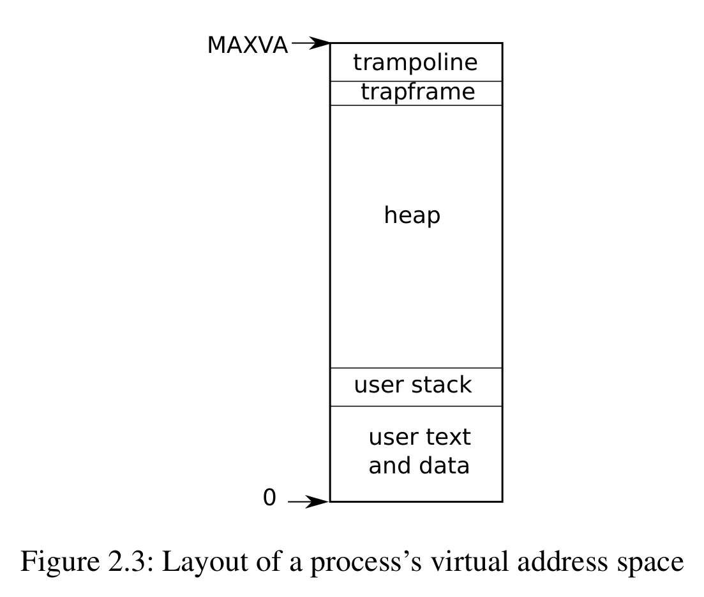

- ## Page table and Address space
	- xv6 uses page tables (which are  implemented by hardware) to give each process its own address space.
		- The RISC-V page table translate a _virtual address_ to a phisical address.
	- xv6 maintains a separate page table for each process that defines that process's address space.
		- {:height 356, :width 417}
		- An address space includes the process's _user memory_ sarting at virtual address zero. Instructions comes first, followed by global variables, then the stack, and finally a "heap" area.
		- The maximum address is $2^{38}-1$, equals `0x3fffffffff`, which is `MAXVA`(kernel/riscv.h)
			- Factors that limit the maximum size of a process's address space are:
				- pointer on the RISC-V are 64 bits wide
				- the hardware only uses the low 39 bits when looking up virtual addresses in page tables. xv6 only uses 38 of 39 bits.
		- At the top of the address space xv6 reserves a page for a trampoline (jump instrutions?) and a page mapping the process's _trapframe_.
			- xv6 uses these two pages to transition into the kernel and back.
			- The trampoline page contains the code to transition in and out of the kernel and mapping the trapframe is necessary to save/restore the state of the user process.
- ## Process state
	- The xv6 kernel maintains many pieces of state for each process, which it gathers in to `struct proc`(kernel/proc.h).
		- A process's most important pieces of kernel state are its **page table**, its **kernel stack**, and its **run state**.
	- `p->state` indicates whether the process i allocated, ready to run, running, waiting for I/O, or exiting.
	- `p->pagetable` holds the process's page table, in the format that the RISC-V hardware expects.
		- xv6 causes the paging hardware to use a process's `p->pagetable` when executing that process in user space.
		- A process's page table also serves as the record of the address of the physical pages allocated to store the process's memory.
- ## Thread of execution
	- Each process has a thread of execution that excutes the process's instructions.
		- A thread can be suspended and later resumed. To switch transparently between processes, the kernel suspends the currently running state and resumes another process's thread.
	- Much of the state of a thread(local variables, function call return addresses) is stored on the thread's stacks.
		- Each process has two stacks: a **user stack** and a **kernel stack**(`p->kstack`)
			- When the process is executing user instructions, only its user stack is in use, its kernel stack is empty.
			- When the process enters the kernel (for a system call or interrupt), the kernel code excutes on the process's kernel stack; while a process is in the kernel, its user stack still contains saved data, but isn't actively used.
		- A prcess's thread alternates between actively using its user stack and its kernel stack. The kernel stack is separate (and protected from user code) so that the kernel can execute even if a process has wrecked its user stack.
- ## Syscall
	- A process can make a system call by executing the RICS-V `ecall` instruction.
		- `ecall` raises the hardware privilege level and changes the program counter to a kernel-defined entry point.
			- The code at the entry point switches to a kernel stack and executes the kernel instructions that implement the system call.
			- When the system call completes, the kernel switches back to the user stack and returns to user space by calling the `sret` instruction, which lowers the hardware privilege level and resumes executing user instructions just after the system call instruction.
		- A process's thread can "block" in the kernel to wait for I/O, and resume where it left off when I/O has finished.
- ## Summary
	- A process bundles two design ideas:
		- An address space to give a process the illusion of its own memory
		- A thread to give the process the illusion of its own CPU.
	- In xv6, a process consists of one address space and one thread. In rea os a process may have more than one thread to take advantage of multiple CPUs.