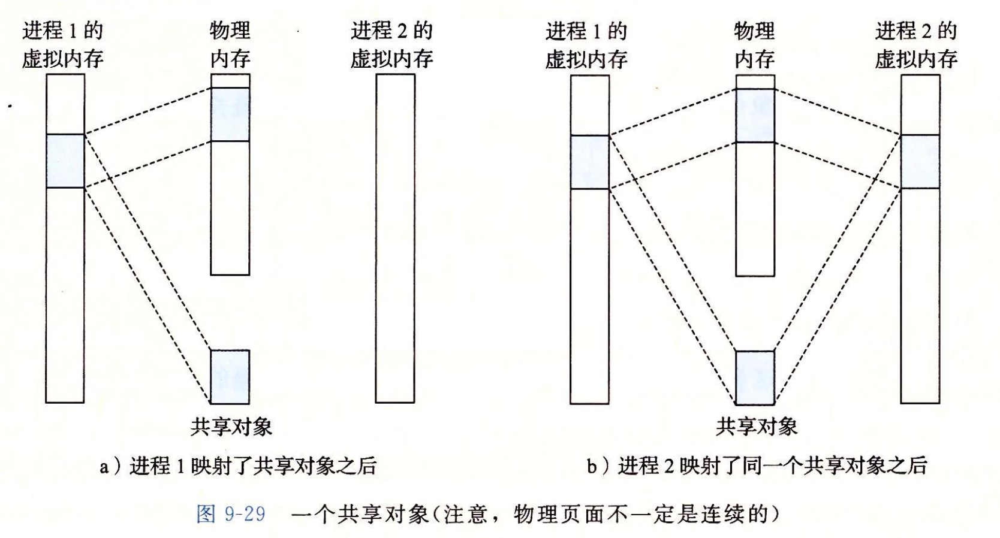
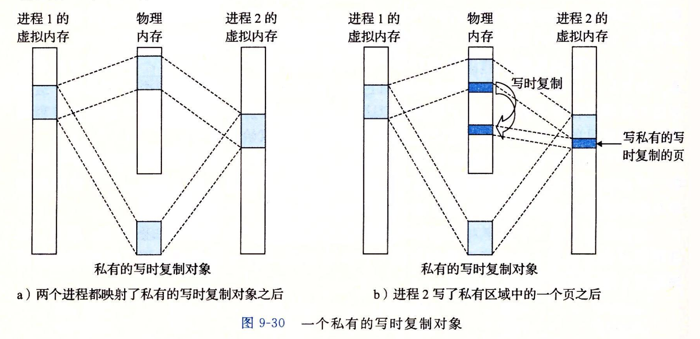
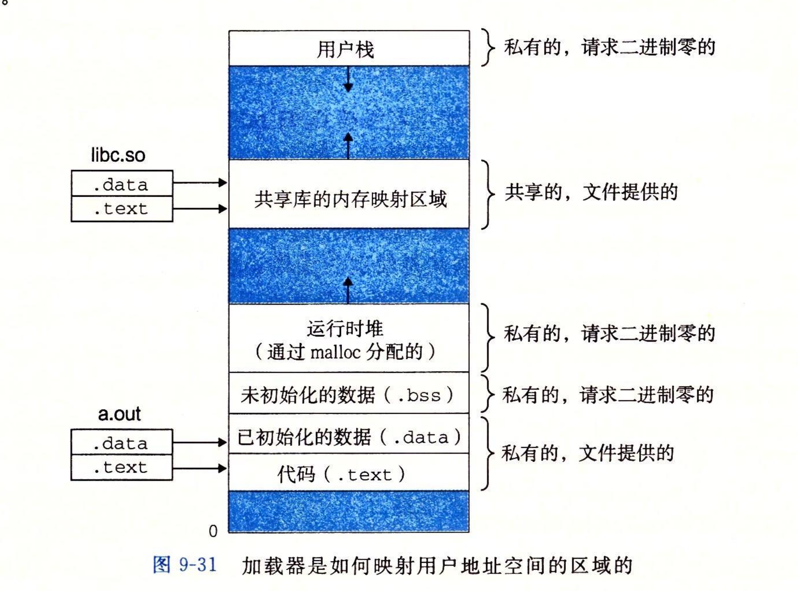
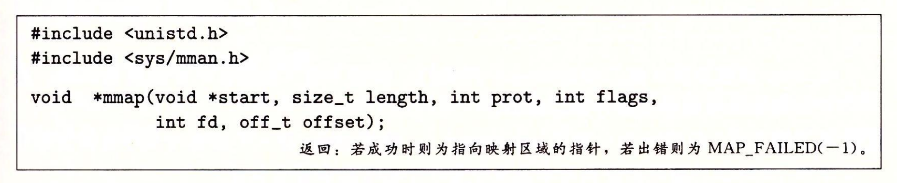
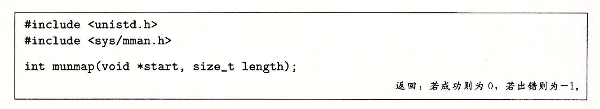

- **内存映射**: Linux将一个虚拟内存区域与一个磁盘上的对象关联起来，以初始化这个虚拟内存区域的内容。
- **映射对象的类型**:
	- 1) _Linux文件系统中的普通文件_
		- 一个区域可以映射到一个普通磁盘文件的连续部分。
		- 文件区(section)被分成页大小的片，每一片包含一个虚拟页面的初始内容。因为按需进行页面调度，直到CPU第一次引用到页面，这些虚拟页面才会交换进入物理内存。
		- 如果区域比文件区大，那么用0来填充这个区域的余下部分。
	- 2) _匿名文件_
		- 匿名文件由内核创建，包含的全是二进制0。
		- CPU第一次引用这样一个区域时，内核就在物理内存中找到一个合适的牺牲页面，如果该页面被修改过，就将这个页面换出来，用二进制零覆盖牺牲页面并更新页表，将这个页面标记为是驻留在内存中的。
		- 磁盘和内存之间并没有实际的数据传送。
		- 映射到匿名文件的区域中的页面有时也叫请求二进制零的页(demand-zero page)。
	- 无论哪种情况，一旦一个虚拟页面被初始化了，它就在一个由内核维护的专门的交换文件(swap file)之间换来换去。
		- 交换文件也叫交换空间(swap space)或者交换区域(swap area)。
		- 在任何时刻，交换空间都限制着当前运行着的进程能够分配的虚拟页面的总数。
- ## 再看共享对象
	- 一个对象可以被映射到虚拟内存的一个区域，要么作为**共享对象**，要么作为**私有对象**。
	- ### 共享对象
		- 如果一个进程将一个共享对象映射到它的虚拟地址空间的一个区域内，那么这个进程对这个区域的任何写操作，对于那些也把这个共享对象映射到他们的虚拟内存的其他进程而言，也是可见的。而且这些变化也会反映在磁盘上的原始对象。
		- 映射到共享对象的虚拟内存区域叫做“共享区域”。
		- 
			- 因为每个对象都有一个唯一的文件名，内核可以迅速地判定进程1已经映射了这个对象，而且可以使进程2中的页表条目指向相应的物理页面。关键点在于即使对象被映射到了多个共享区域，物理内存也只需要存放共享对象的一个副本。
	- ### 私有对象
		- 对于一个映射到私有对象的区域做的改变，对于其他进程来说是不可见的，并且进程对这个区域所做的任何写操作都不会反映在磁盘上的对象中。
		- 私有对象使用**写时复制**的巧妙技术被映射到内存中。一个私有对象开始生命周期的方式基本上与共享对象一样，在物理内存中只保存私有对象的一份副本。
		- 
			- 两个进程将一个私有对象映射到它们虚拟内存的不同区域，但是共享同一个物理副本。
			- 对于每个私有对象的进程，相应私有区域的页表项目都被标记为只读，并且区域结构被标记为**私有的写时复制**。只要没有进程试图写它自己的私有区域，它们就继续共享物理内存中对象的一个单独副本。
			- 只要又一个进程试图写私有区域内的某个页面，那么这个写操作就会触发一个保护故障。当故障处理程序注意到保护异常是由于进程试图写**私有的写时复制**区域中的一个页面而引起的，它就会在物理内存中创建这个页面的一个新副本，更新页表条目指向这个新的副本，然后恢复这个页面的可写权限。
- ## 再看`fork`函数
	- 当`fork`函数被当前进程调用时，内核为新进程创建各种数据结构，并分配给它一个唯一的PID。为了给这个新进程创建虚拟内存，它创建了当前进程的`mm_struct`、区域结构和页表的原样副本。 它将两个进程中的每个页面都标记为只读，并将两个进程中的每个区域结构都标记为私有的写时复制。
	- 当`fork`从新进程返回时，新进程现在的虚拟内存刚好和调用`fork`时存在的虚拟内存相同。当两个进程中任一个后来进行写操作时，写时复制机制就会创建新页面。因此，每个进程保持了私有地址空间的抽象概念。
- ## 再看`execve`函数
	- 假设当前进程执行了这个`execve`调用——`execve("a.out", NULL, NULL)`。加载并运行`a,out`包含以下几个步骤:
		- **删除已存在的用户区域**
			- 删除当前进程虚拟地址的用户部分已存在的区域结构。
		- **映射私有区域**
			- 为新程序的代码、数据、`bss`和栈区域创建新的区域结构。所有这些新的区域都是私有的、写时复制的。
			- 代码和数据区域被映射为`a.out`文件中的`.text`和`.data`区。
			- `bss`是请求二进制零的，映射到匿名文件，其大小包含在`a.out`中。
			- 栈和堆区域也是请求二进制零的，初始长度为零。
		- **映射共享区域**
			- 如果`a.out`程序与共享对象连接，比如标准C库`libc.so`，那么这些对象都是动态链接到这个程序的，然后再映射到虚拟地址空间中的共享区域内。
		- **设置程序计数器**
			- `execve`做的最后一件事就是设置当前进程上下文中的程序计数器，使之指向代码区域的入口点。
	- 下一次调度这个进程时，它将从这个入口点开始执行。Linux将根据需要换入代码和数据页面。
	- 
- ## 使用`mmap`函数的用户级内存映射
	- 
	- `mmap`函数要求内核创建一个新的虚拟内存区域。最好是从地址`start`开始的一个区域，并将文件描述符`fd`指定的对象的一个连续的片映射到这个新的区域。
	- 连续的片大小为`length`字节，从据文件开始处偏移量为`offset`字节的地方开始。
	- `start`地址仅仅是一个暗示，通常被定义为NULL。
	- 参数`prot`包含描述新映射的虚拟内存区域的访问权限位(即在相应区域结构中的`vm_prot`位)
		- `PROT_EXEC` 这个区域的页面由可以被CPU执行的指令组成。
		- `PROT_READ` 这个区域的页面可读。
		- `PROT_WRITE` 这个区域的页面可写。
		- `PROT_NONE` 这个区域的页面不能被访问。
	- 参数`flags`由描述被映射对象类型的位组成。
		- `MAP_ANON`标记位，被映射的对象是一个匿名对象。
		- `MAP_PRIVATE`标记位，被映射的对象是一个私有的、写时复制的对象。
		- `MAP_SHARED`标记位，被映射的对象是一个共享对象。
	- 
		- `munmap`函数删除虚拟内存的区域。从虚拟地址`start`开始，接下来的由`length`字节组成的区域。之后对已删除区域的引用会导致段错误。