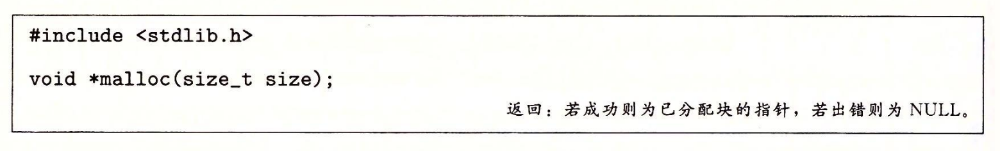
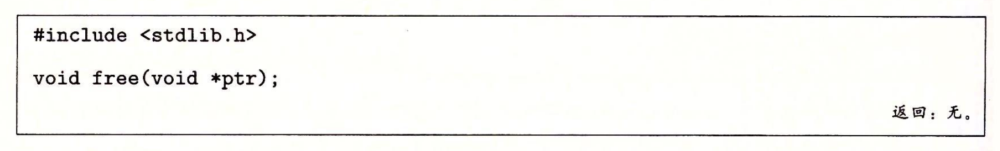

- 动态内存分配器维护着一个进程的虚拟内存区域，称为“堆”。对于每个进程，内核维护一个变量`brk`，它指向堆的顶部。
- 分配器将堆视为一组不同大小的“块”的集合。每个块就是一个连续的虚拟内存片，要么是已分配的，要么是空闲的。已分配的块显式地供应用程序使用，空闲的块可用来分配。
- 已分配的块保持已分配状态，直到被释放。要么是程序显式释放，要么是分配器隐式执行。
	- **显式分配器**: 要求应用显式地释放任何已分配的块。
	- **隐式分配器**: 检测一个块何时不被使用，然后释放它。也叫“垃圾收集器”。
- ## `malloc`
	- 
	- `malloc`返回一个指针，指向至少`size`字节的内存块。这个块可能包含在这个块内的任何数据对象类型做对齐。
- ## `free`
	- 
	- `ptr`参数必须指向一个从`malloc`、`calloc`或者`realloc`获得的已分配块的起始位置。如果不是，那么`free`的行为就是未定义的。
- ## [[eg ------ CSAPP 管理内存]]
- ## 为什么使用内存分配？
	- 经常直到程序实际运行时，才知道某些数据结构的大小
- ## 分配器的要求和目标
	- ### 约束条件
		- _处理任意请求序列_
			- 一个应用可以任意的分配请求和释放请求序列，只要满足约束条件: **每个请求必须对应于一个当前已分配块，这个块是由一个以前分配请求获得的**。
			- 由这个条件可知，分配器不可以假设分配和释放请求的顺序。
		- _立即响应请求_
			- 分配器必须立即响应请求。因此，不允许分配器为了提高性能重新排列或者缓冲请求。
		- _只使用堆_
			- 为了是分配器是可扩展的，分配器使用的任何非标量数据结构都必须保存在堆里。
		- _对齐块_
			- 分配器必须对齐块，使得它们可以保存任何类型的数据对象。
		- _不修改已分配的块_
			- 分配器只能操作或者改变空闲块。
	- ### 目标
		- 在以上约束条件下，实现两个相互冲突的性能目标。
		- _最大化吞吐率_
			- 吞吐率定义为每个单位时间里完成的请求数。例如，如果分配器在1秒内完成500个分配请求和500个释放请求，那么吞吐率就是每秒1000次操作。
			- 通常，通过使满足分配和释放请求的平均时间最小化来使吞吐率最大化。
			- 分配器的合理性能: 一个分配请求的最糟运行时间与空闲块的数量成线性关系，而一个释放请求的运行时间是个常数。
		- _最大化内存利用率_
			- 一个系统中被所有进程分配的虚拟内存的全部数量是受磁盘上交换空间的数量限制的。
		- _峰值利用率(peek utilization)_
			- 给定$n$个分配和释放请求的某种顺序$$R_0,R_1,\cdot,R_k,\cdot,R_{n-1}$$。如果一个应用程序请求一个$p$字节的块，那么得到的已分配的有效载荷(payload)是$p$字节。在请求$R_k$完成之后，聚集有效载荷(aggergate payload)表示为$P_k$，为当前已分配的块的有效载荷之和，而$H_k$表示堆的当前大小。
			- 如果前$k+1$个请求的峰值利用率表示为$U_k$，则:
				- $$U_k=\frac{max_{i \leq k} P_i}{H_k}$$
			- 分配器的目标就是在整个序列中使峰值利用率$U_{n-1}$最大化。
- ## 碎片
	- 有未使用的内存但不能用来满足分配请求，被称为**碎片**现象。
		- _内部碎片_
			- 一个已分配块比有效载荷大时发生。很多原因可能造成这个问题，比如分配器对申请的块大小有最小值的限制。
			- 内部碎片的量化就是已分配块大小和它们有效载荷之间的差的和。
		- _外部碎片_
			- 空闲内存的合计大小满足一个分配请求，但没有一个单独的空闲块足够大到可以处理这个请求。
			- 外部碎片很难量化
- ## 分配器实现问题
	- _空闲块组织_: 如何记录空闲块？
	- _放置_: 如何选择一个合适的空闲块来放置一个新分配的块？
	- _分割_: 将一个新分配的块放置到某个空闲块之后，如何处理空闲块中的剩余部分？
	- _合并_: 如何处理一个刚被释放的块？
- ## [[隐式空闲列表]]
-