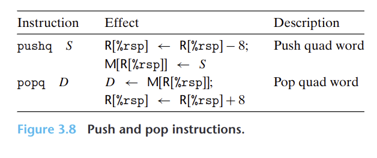

- `pushq`指令把数据压入到栈上，而`popq`指令弹出数据。这些指令都只有一个操作数--压入的数据和弹出数据的目的。
- `%rsp`指向的总是栈顶。
- {:height 222, :width 522}
- 压入栈的效果是，栈指针`%rsp`指向的位置减8，然后将数据写到目标位置。
- 弹出栈的效果是，将数据读到目标位置，栈指针`%rsp`指向的位置加8。
- 为什么是8？因为操作数是四字64位，占用8个字节，栈指针指向的每一个位置可以存储1个字节的数字。
- 因为栈和程序代码以及其他形式的程序数据都是放在同一内存中，所以程序可以用标准的内存寻址方法访问栈内的任意位置。如`movq 8(%rsp), %rdx`会将栈顶的**第二个**四字复制到`%rdx`中。