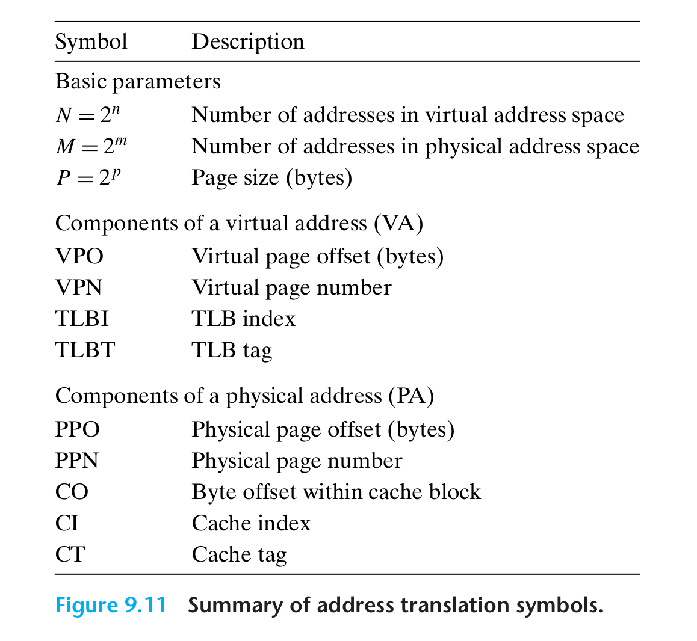
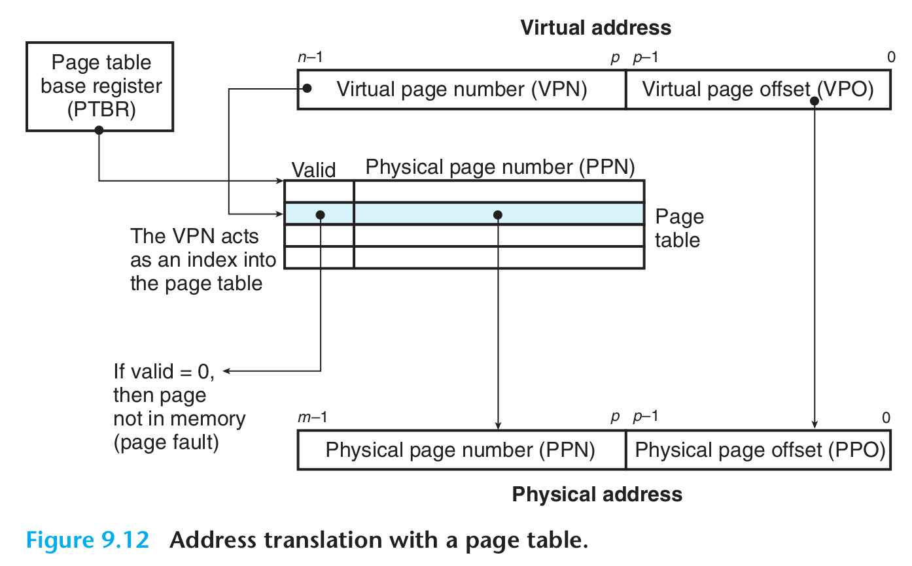
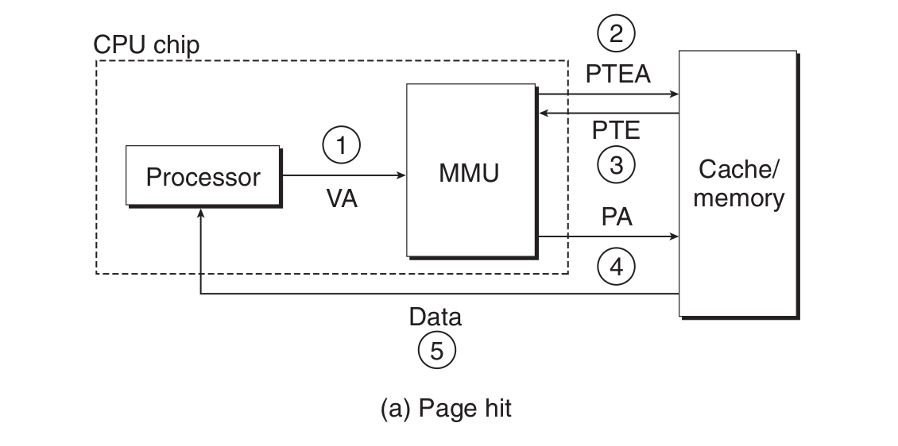
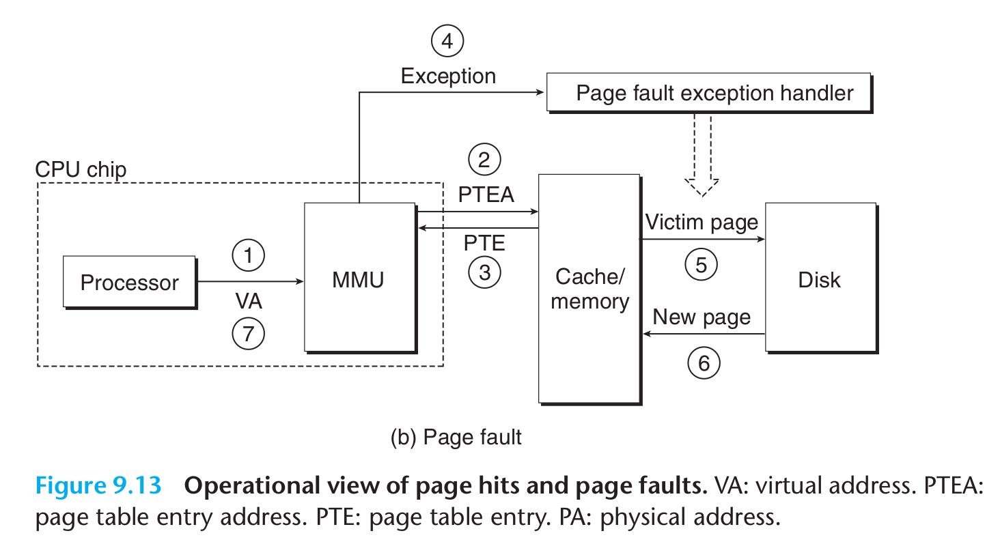
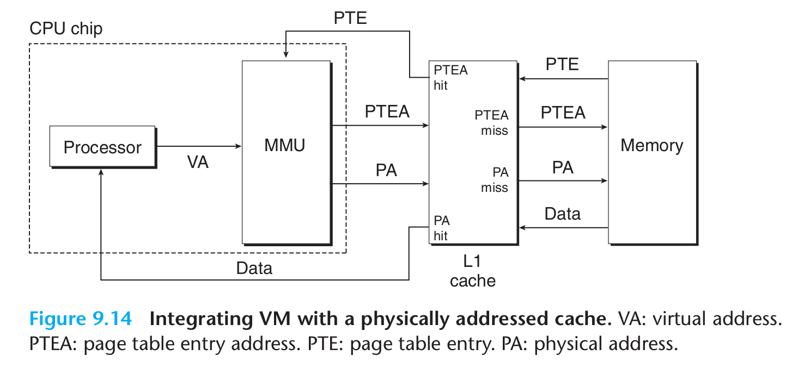
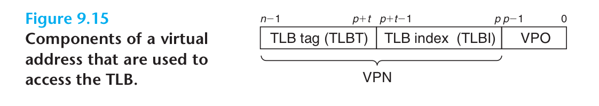
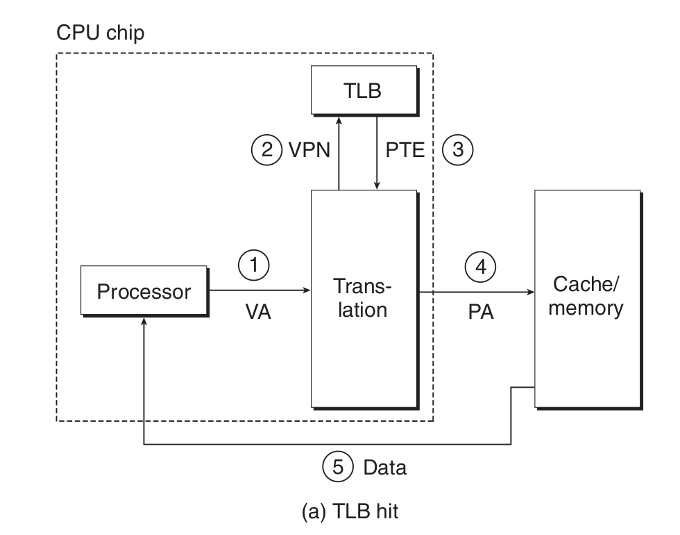
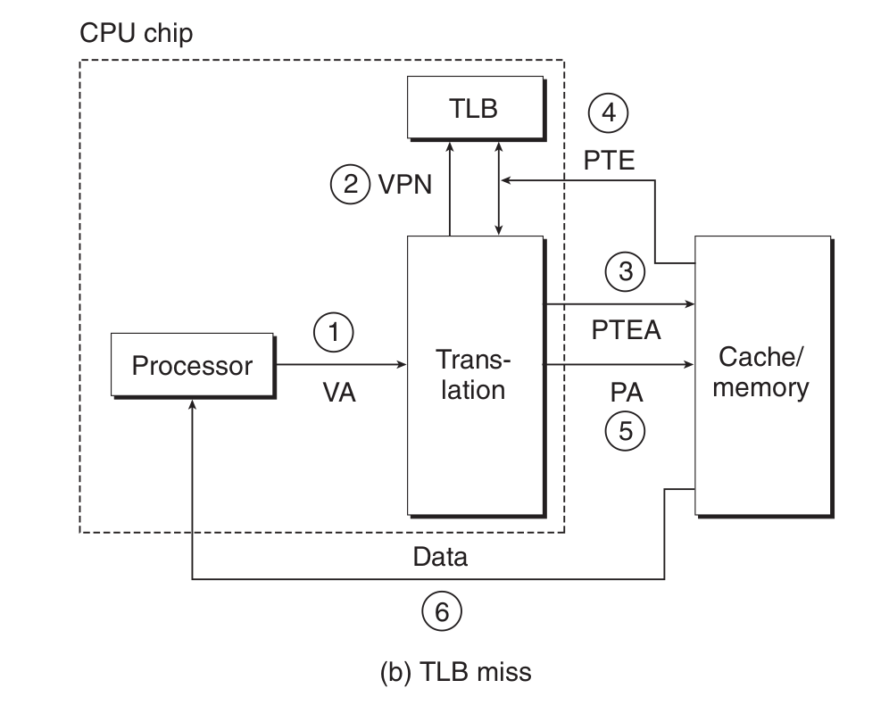

- **符号**
	- {:height 364, :width 394}
- 形式上来说，地址翻译是一个$N$元素的虚拟地址空间(VAS)中的元素和一个$M$元素的物理地址空间(PAS)中元素之间的映射
	- $$\text{MAP}: \text{VAS} \to \text{PAS} \cup \varnothing$$
		- 如果虚拟地址$A$处的数据在PAS的物理地址$A^{\prime}$处，则$\text{MAP}(A) = A^{\prime}$
		- 如果虚拟地址$A$处的数据不在物理内存中，则$\text{MAP}(A) = \varnothing$
	- **使用页表的地址翻译**
		- 
		- CPU中的一个控制寄存器，**页表基址寄存器**(Page Table Base Register，PBTR)指向当前页表。
		- $n$位的虚拟地址包含两个部分: 一个$p$位的**虚拟页面偏移**(Virtual Page Offset，VPO)和一个$(n-p)$位的**虚拟页号**(Virtual Page Number，VPN)。
		- MMU利用VPN来选择适当的PTE。例如，VPN 0 选择 PTE 0，依次类推。将页表条目中的**物理页号**(Physical Page Number，PPN)和虚拟地址中的VPO串联起来，就得到相应的物理地址。
		- 因为物理和虚拟页面都是$P$字节的，所以**物理页面偏移**(Physical Page Offset，PPO)和VPO是相同的。
	- **页面命中时，CPU硬件执行的步骤**
		- 
		- 第二步，`MMU`向缓存发送页表项的地址，然后缓存返回得到页表项。
	- **页面命中和缺页的操作**
		- 
- ## 结合高速缓存和虚拟内存
	- 大多数系统使用物理地址来访问SRAM高速缓存。
		- 使用物理寻址，多个进程可以方便的同时在高速缓存中有存储块和共享来自相同虚拟页面的块。
		- 高速缓存无需处理保护问题。
	- **物理寻址的高速缓存和虚拟内存结合**
		- 
			- 地址翻译发生在高速缓存查找之前。注意，页表条目可以缓存。
- ## 利用TLB加速地址翻译
	- **TLB**(Translation Lookaside Buffer，翻译后备缓冲器)，在MMU中的关于PTE的小缓存，其中每一行都保存着一个由单个PTE组成的块。
		- 
			- TLB通常具有高度的相联度，用于组选择和行匹配的索引和标记字段是从虚拟地址中的虚拟页号(VPN)中提取出来的。
			- 如果TLB有$T=2^t$个组，那么**TLB索引**(TLBI)是由VPN的$t$个最低位组成，而**TLB标记**(TLBT)是由VPN剩余的位组成。
	- **TLB命中时**
		- 所有的地址翻译步骤都是在芯片上的MMU中执行的，因此非常快。
		- {:height 287, :width 362}
		- 第1步: CPU产生一个虚拟地址。
		- 第2步和第3步: MMU从TLB中去除相应的PTE。
		- 第4步: MMU将这个虚拟地址翻译成一个物理地址，并将它发送到高速缓存/主存。
		- 第5步: 高速缓存/主存将所请求的数据字返回给CPU。
	- **TLB不命中**
		- {:height 362, :width 447}
		- 当TLB不命中时，MMU必须从L1缓存中去除相应的PTE。新取出的PTE存放在TLB中，可能会覆盖一个已经存在的条目。
- ## 多级页表
	- 页表存储在内存中，对于一个32位的地址空间，4KB大小的页面和大小为4字节的PTE的机器来说，它需要占用4MB的空间来存储页表 ($2^{32} \div (4 \times 2^{10}) * 4\text{byte} = 4\text{MB}$)。 若是一个64位地址空间的机器来说，它需要$2^{32} * 4\text{MB}$，这个占用就太大了。所以需要使用多级页表。
	- [[eg ------ CSAPP 多级页表]]
- ## [[eg ------ CSAPP 端到端的地址翻译]]
-