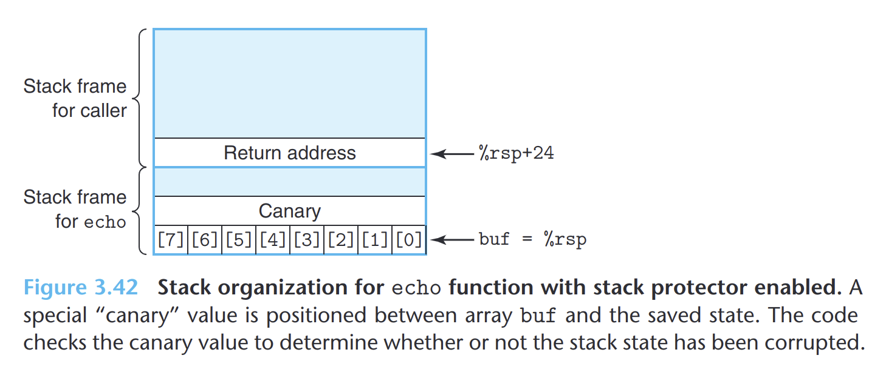

- **指针**
	- 每个指针都对应一个类型。
	- 每个指针都有一个值，这个值是某个指定类型的对象的地址。
	- 将指针从一种类型强制转换成另一种类型，只改变它的类型，不改变它的值。
		- 强制类型转换的一个效果是改变指针运算的伸缩。假设p是一个`char *`类型的指针，那么`(int *)p + 7`的结果是`p + 28`，而`(int *)(p + 7)`的结果是`p + 7`。
	- 指针也可以指向函数。
- **内存越界引用**
	- C对于数组引用不进行任何边界检查，又因为局部变量和状态信息斗方在栈中。这两者结合就能导致严重的程序错误。对越界的数组元素的写操作会破坏存储在栈中的状态信息。
	- **缓冲区溢出**
		- 在栈中分配某个字符数组来保存一个字符串，但字符串的长度超出了数组分配的空间。
		- 如果存储返回地址的值被破坏，可能导致程序跳转到一个完全意想不到的位置。
		- `gets`、`strcpy`、`strcat`、`sprintf`都有可能导致存储溢出，因为它们都没有指定目标缓冲区的大小。`fgets`可以替换`gets`
		- 一个致命应用是利用缓冲区溢出来进行攻击
			- 给程序输入一个字符串，字符串包含一些可执行的攻击代码，另外一些字节利用包含指向攻击代码的指针覆盖返回地址。完成攻击
	- **栈随机化**
		- 在系统中插入攻击代码，攻击者既要插入代码，也要插入指向这段代码的指针。产生这个指针需要知道这个字符串放置的栈地址。以前栈的位置很容易预测，因为不同机器之间栈的位置相同，所以很容易被用来攻击。
		- 栈随机化使栈的位置在程序每次运行时都有变化。这就让不同机器虽然运行相同的程序，但栈地址不同。
			- **实现**: 程序开始时，在栈上分配一段`0~n`字节之间的随机大小的空间。程序不使用这段空间，但这回导致程序每次执行时后续的栈位置发生变化。
	- **栈破坏检测**
		- 虽然没有可靠的办法来防止对数组的越界写，但可以在发生越界写的时候检测到它。
		- **思想**
			- {:height 230, :width 543}
			- 在栈帧中任何局部缓冲区于栈状态之间存储一个特殊的**金丝雀**值，也称为**哨兵**值。
			- 这个值在每次程序运行时随机产生。
			- 在恢复寄存器状态和从函数返回之前，程序检测这个金丝雀值是否被该函数的某个操作或者该函数调用的某个函数的某个操作改变了，如果是，那么程序异常终止。
	- **限制可执行代码区域**
		- 限制那些内存区域能够存放可执行代码。在典型的程序中，只有保存编译器产生的代码的那部分内存才需要可执行。
- **支持变长栈帧**
	- 以下情况，局部存储是可以变长的
		- `alloca`标准库函数在栈上分配任意字节数量的存储。
		- 代码声明局部变长数组。
	- x86-64使用寄存器`%rbp`作为**帧指针**。