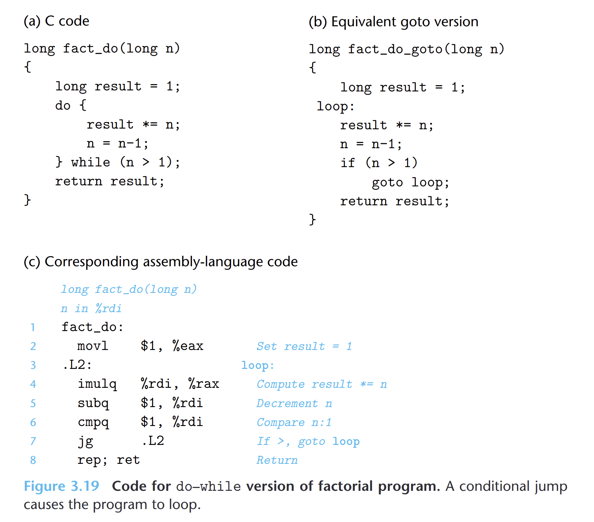
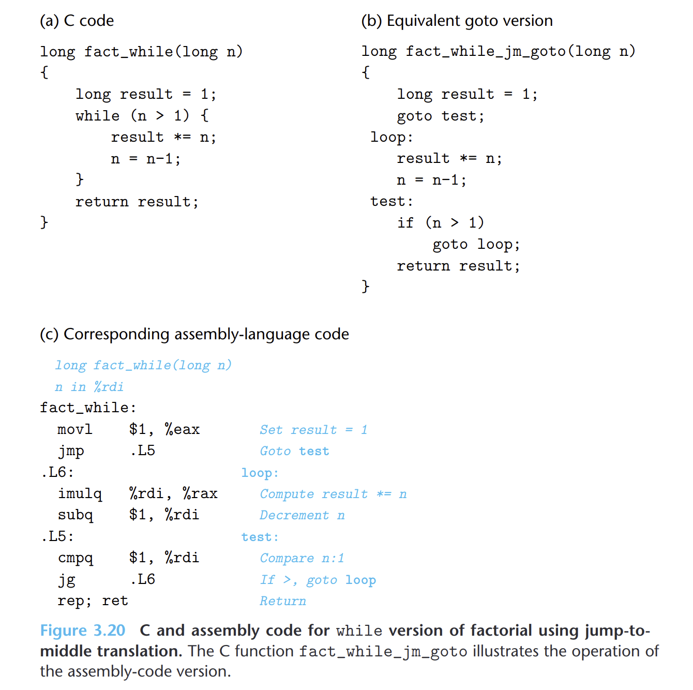
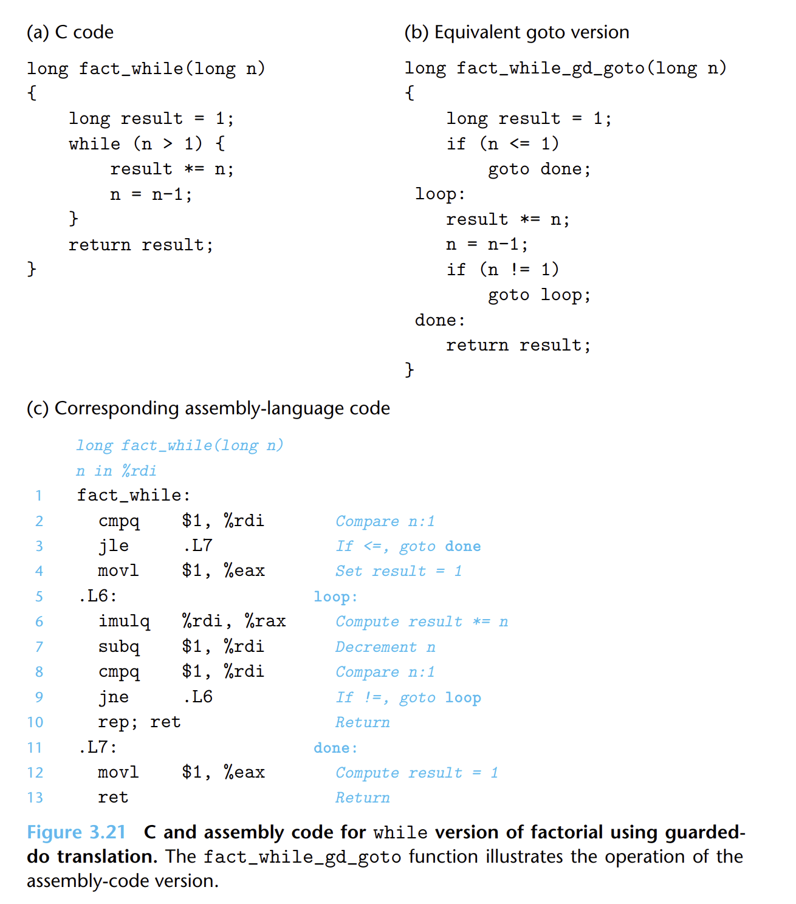

- ## do-while
	- {:height 481, :width 547}
- ## while
	- ### jump to middle
		- {:height 566, :width 562}
	- ### guarded-do
		- {:height 637, :width 554}
- ## for
	- `for`循环可以转换成等价的`while`循环，然后根据使用的优化策略，使用不同`while`版本的汇编。
	-