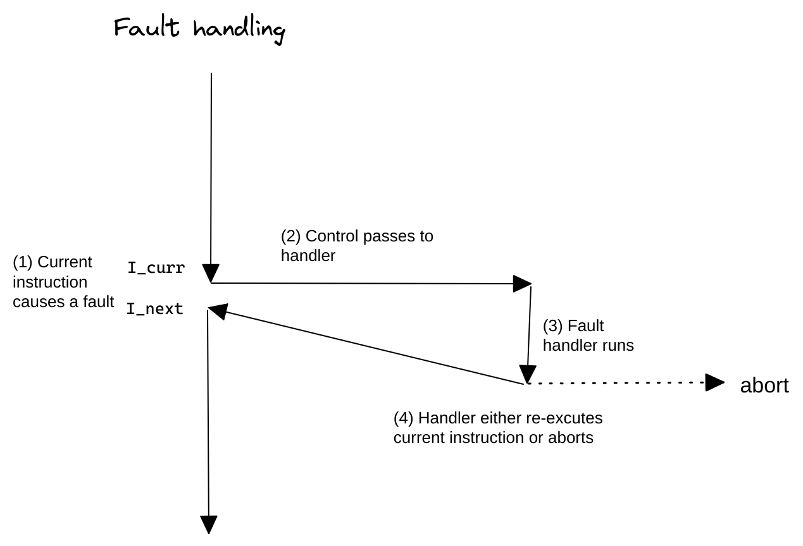

- ## 概念
	- 故障由错误引起，它可能被故障处理程序修正。
- ## 流程
	- ```text
	  故障发生。
	  处理器将控制转移给故障处理程序。
	  if 可以修正？
	  	将控制返回给引起故障的指令，重新执行它。
	  else
	  	处理程序返回到内核中的abort例程，终止引起故障的程序
	  ```
	- 
- ## 例子： 缺页异常
	- ```text
	  指令引用了一个虚拟地址
	  与该地址相对应的物理页面不在内存中，需要从磁盘取出，发生故障。
	  缺页处理程序从磁盘加载适当的页面，将控制返回给引起故障的指令。
	  重新执行指令，相应的物理页面在内存中，指令继续运行。
	  ```