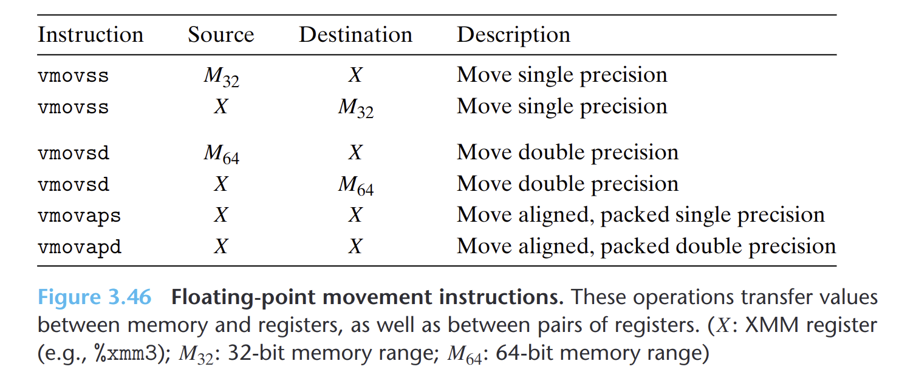

- 
	- 引用内存的指令是**标量**指令，意味着它们只对单个而不是一组封装好的数据值进行操作。数据要么包存在内存中，要么包存在`XMM`寄存器中。
	- 无论数据对齐与否，这些指令都能正确执行，不过建议32位内存数据满足4字节对齐，64位数据满足8字节对齐。
	- 内存引用的指定方式和`MOV`指令一样，包括偏移量、基址寄存器、变址寄存器和伸缩因子的所有可能的组合。
- GCC只用**标量传送操作**操作数据在内存和寄存器的往返。
- 对于两个`XMM`寄存器之间传送数据，GCC会使用`vmovaps`或`vmovapd`。
- 当这些指令用于读写内存时，如果地址不满足16字节对齐，它们会导致异常。如果两个寄存器之间传送数据，绝不会出现错误对齐的状况。