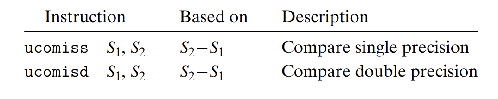
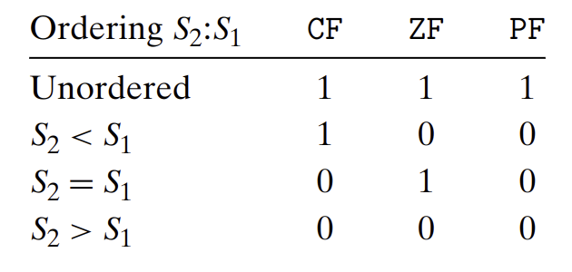

- **比较指令**
	- 
		- 参数$S_2$必须在`XMM`寄存器中，$S_1$可以在寄存器中也可以在内存中。
- **条件码设置条件**
	- {:height 223, :width 461}
	- 浮点比较指令会设置3个条件码：`ZF`(零标志位)、`CF`(进位标志位)、`PF`(奇偶标志位，最低位字节有偶数个1)。
	- 浮点比较，两个操作数有任意一个是`NaN`时，`PF`会被设置。C语言中如果有个参数为`NaN`就会认为比较失败，`PF`用来发现这样的条件。
	- 任意操作数为`NaN`时，就为**无序**。
	- `jp`指令是条件跳转，条件就是浮点比较得到一个无序的结果。