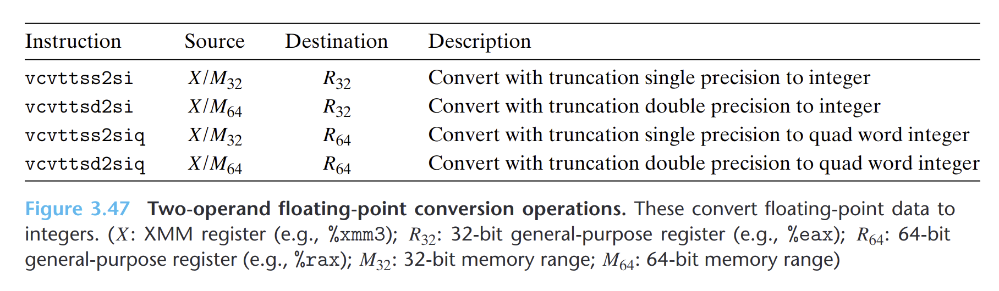
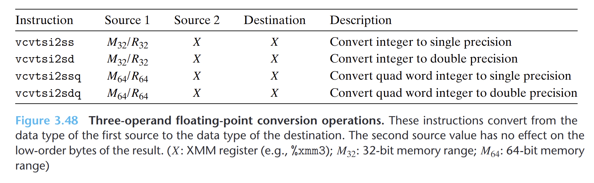

- 双操作数浮点转换指令
	- 
	- 从`XMM`寄存器或内存中读出的浮点值进行转换，并将结果写入一个通用寄存器。
	- 把浮点值转换成整数时，指令会执行**截断**，把值向0进行舍入。
- 三操作数浮点转换指令
	- 
	- 第一个操作数读来自于内存或通用目的寄存器的数据。
	- 第二个操作数只影响结果的高位字节。
	- 目的操作数必须是`XMM`寄存器。在常见的使用场景中，第二个源和目的操作数一样
- GCC单精度双精度互相转换(**和直觉不同**)
	- 单->双
		- ```asm
		  vunpcklps %xmm0, %xmm0, %xmm0
		  vcvtps2pd %xmm0, %xmm0
		  ```
	- 双->单
		- ```asm
		  vmovddup 	%xmm0, %xmm0
		  vcvtpd2psx 	%xmm0, %xmm0
		  ```