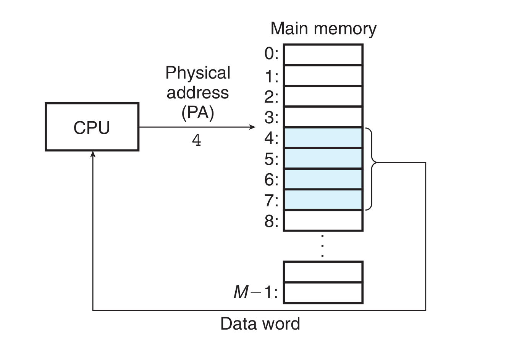
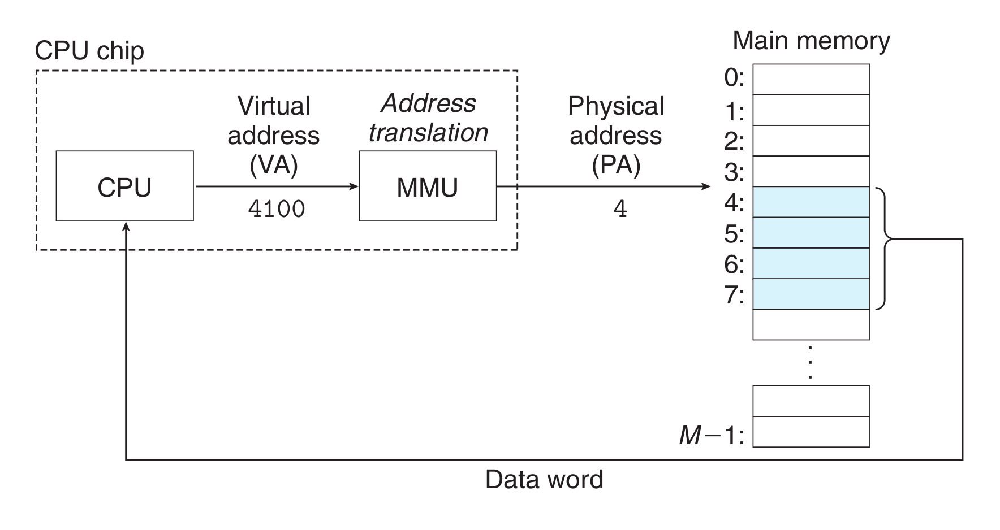

- **物理寻址**
	- 计算机系统的主存被组织成一个由$M$个连续的字节大小的单元组成的数组。每字节都有一个唯一的**物理地址**(Physical Address, PA)。
	- 每个字节的地址按序依次编号。CPU使用这样的地址称为**物理寻址**。
	- {:height 406, :width 599}
		- CPU从物理地址4处开始读取四字字节
- **虚拟寻址**
	- 现代处理器使用**虚拟寻址**。CPU通过生成一个**虚拟地址**(Virtual Address, VA)来访问主存，这个虚拟地址在被送到内存之前使用**地址翻译**(address translation)先转换成适当的物理地址。
	- CPU芯片上叫做**内存管理单元**(Memory Management Unit, MMU)的专用硬件，利用存放在主存中的查询表来动态翻译虚拟地址，该表的内容由操作系统管理。
	- 
	-