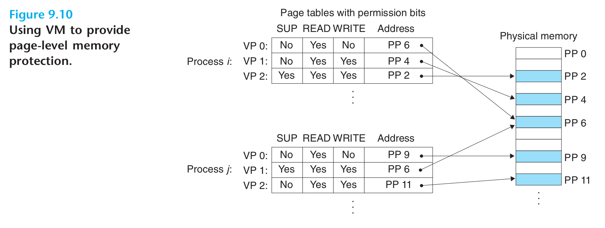

- 计算机系统必须为操作系统提供手段来控制对内存系统的访问，通过在PTE上添加一些额外的许可位可以实现它。
- {:height 302, :width 776}
	- PTE有三个许可位。
		- `SUP`表示进程是否必须运行在内核模式下才能访问该页。
		- `READ`和`WRITE`控制对页面的读写。
	- 如果一个指令违反了许可条件，那么CPU就触发一个一般保护故障，将控制传递给异常处理程序。