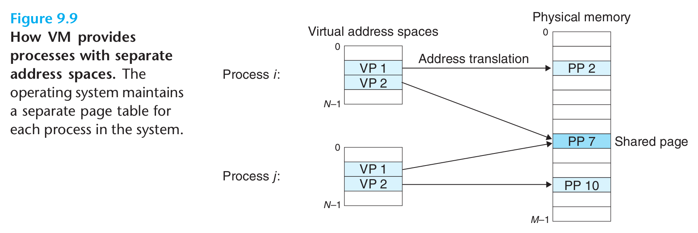

- 操作系统为每一个进程提供了一个独立的页表，也就是一个独立的虚拟地址空间。
	- 
		- 进程`i`的页表将VP1映射到PP2，VP2映射到PP7。
		- 进程`j`的页表将VP1映射到PP7，VP2映射到PP10。
		- 多个虚拟页面可以映射到同一个共享物理页面上。
	- 按需页面调度和独立的虚拟地址空间的结合，对系统中内存的使用和管理造成了深远的影响。特别地，VM简化了链接和加载、代码和数据共享，以及应用程序的内存分配。
		- **简化链接**
			- 独立的地址空间允许每个进程的内存映像使用相同的基本格式，而不用管代码和数据实际存放在物理内存的何处。这样的一致性简化了链接器的设计和实现，允许链接器生成完全链接的可执行文件，这些可执行文件独立于物理内存中代码和数据的最终位置。
		- **简化加载**
			- 要把目标文件中`.text`和`.data`节加载到一个新创建的进程中，Linux加载器为代码和数据段分配虚拟页，把它们标记为无效的(即未被缓存的)，将页表条目指向目标文件的适当位置。
			- 加载器不从磁盘到内存复制任何数据。
		- **简化共享**
			- 独立地址空间为操作系统提供了一个管理用户进程和操作系统自身之间共享的一致机制。
			- 一般而言，每个进程有自己私有的代码、数据、堆以及栈区域，是不和其他进程共享的。在这中情况中，操作系统创建页表，将相应的虚拟页映射到不连续的物理页面。
			- 操作系统通过将不同进程中适当的虚拟页面映射到相同的物理页面，从而安排多个进程共享这部分代码的一个副本。
		- **简化内存分配**
			- 当一个运行在用户进程中的程序要求额外的堆空间时，操作系统分配一个适当数字(如`k`)个连续的虚拟内存页面，并且将它们映射到物理内存中任意位置的`k`个任意的物理页面。
			- 因为页表的工作方式，操作系统没有必要分配`k`个连续的物理内存页面。页面可以随机地分散在物理内存中。