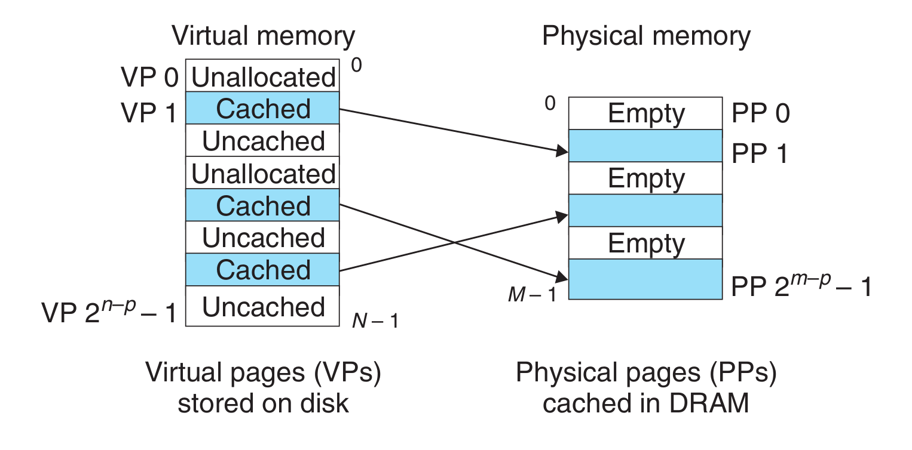
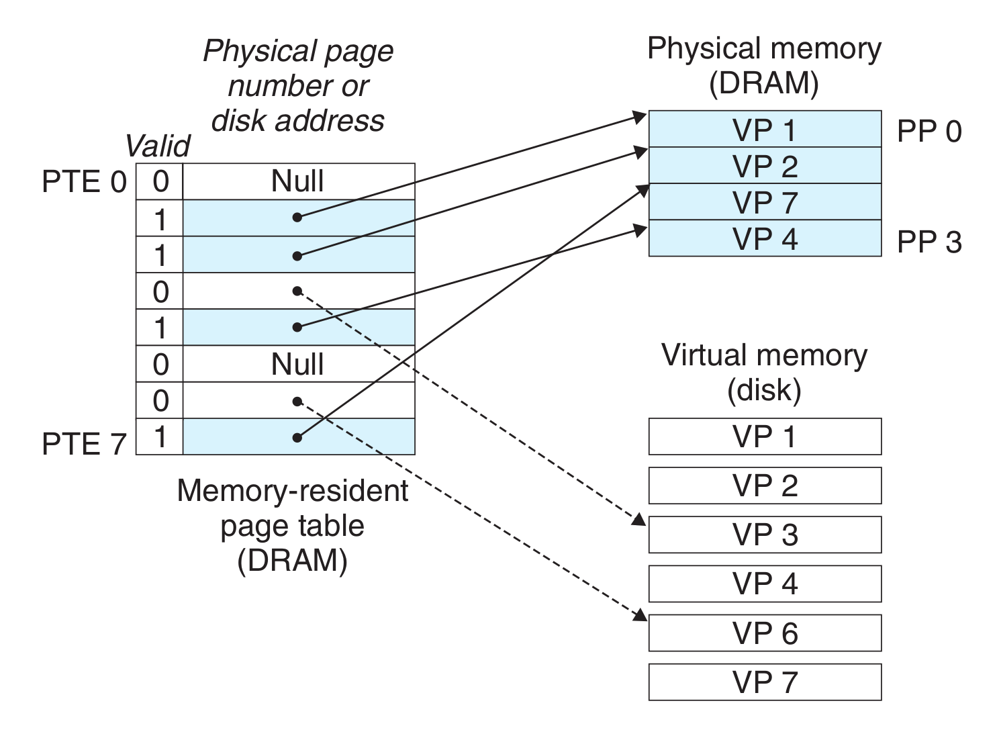

- 虚拟内存被组织为一个由存放在磁盘上的$N$个连续的字节大小的单元组成的数组。
	- 每个字节都有唯一的虚拟地址，作为数组的索引。
	- 磁盘上数组的内容被缓存在主存中。
	- 磁盘上的数据被分割成块，这些块作为磁盘和主存之间的传输单元。
		- VM系统通过将虚拟内存分割成**虚拟页**(Virtual Page, VP)这种大小固定的块。每个虚拟页的大小为$P = 2^p$字节。
		- 物理内存被分割成**物理页**(Physical Page, PP)，大小也为$P$字节。物理页也被称为**页帧**(page frame)。
- 在**任意**时刻，虚拟页面的集合都分为三个**不相交**的子集:
	- **未分配的**: VM系统还未分配(或者创建)的页。未分配的块没有任何数据和它们相关联，因此也不占用磁盘空间。
	- **缓存的**: 当前已缓存在物理内存中的已分配页。
	- **未缓存的**: 未缓存在物理内存中的已分配页。
	- 
- **DRAM缓存的组织结构**
	- **现象: DRAM缓存不命中开销巨大**
		- DRAM比SRAM慢大约10倍，磁盘比DRAM慢大约100000多倍。由于DRAM的缓存不命中由磁盘来服务，因此DRAM的缓存不命中比起SRAM的缓存不命中要昂贵得多。且从磁盘的一个扇区读取第一个字节的时间开销比起读这个扇区中连续的字节要慢大约100000倍。
		- 替换错了虚拟页的处罚也非常高。
	- **结果: 虚拟页很大，通常是4KB~2MB。**
	- **结果: DRAM缓存是全相联的，任何虚拟页都可以放置在任何的物理页中。**
	- **结果: 更复杂精密的替换算法。**
	- **结果: DRAM缓存总是使用写回，而不是直写。**
- **页表**
	- 虚拟内存系统通过操作系统软件、MMU中的地址翻译硬件和存放在物理内存中的**页表**(page table)以某种办法判定一个虚拟页是否缓存在DRAM的某个地方。
		- 如果是，系统还必须确定这个虚拟页存放在哪个物理页中。
		- 如果否，系统必须判断这个虚拟页存放在磁盘的哪个位置，在物理内存中选择一个牺牲页，并将虚拟页从磁盘复制到DRAM中，替换这个牺牲页。
	- 页表就是一个**页表条目**(Page Table Entry, PTE)的数组。
		- 
		- 假设每个PTE是由一个**有效位**(valid bit)和一个$n$位地址字段组成的。
			- 若设置了有效位，则地址字段表示DRAM中相应的物理页的起始位置，这个物理页缓存了该虚拟页。
			- 若没有设置有效位，
				- 地址为空表示这个虚拟页还没有被分配。
				- 地址不为空，地址指向该虚拟页在磁盘上的起始位置。